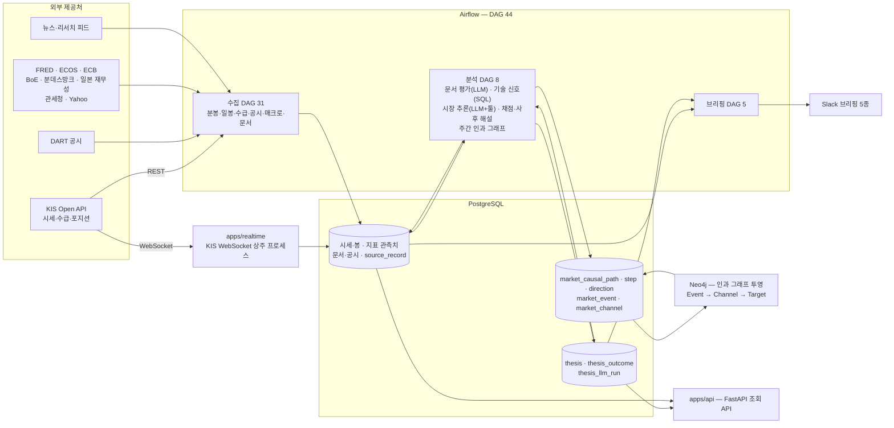

# finance — 시장 데이터 수집·LLM 시장 추론·검증 파이프라인

국내외 시장 데이터와 공시·리서치 문서를 매일 모아 Postgres에 쌓고, 그 위에서 LLM이
**"오늘 시장이 왜 이렇게 움직였을까 / 앞으로 어떻게 움직일까"**를 근거와 함께 적어 둡니다.
그리고 며칠 뒤 실제 결과로 그 판단을 채점합니다.

혼자 만들고 있는 프로젝트이고, 지금은 집에 있는 Synology NAS에서 매일 돌고 있습니다.

저장소를 직접 돌려 보시려면 [docs/operations.md](docs/operations.md)에 설정·마이그레이션·배포가
정리돼 있고, 설계 문서 색인은 [docs/README.md](docs/README.md)에 있습니다.

## 목적

투자 및 경제 판단을 돕는 많은 데이터는 존재하지만, 보는 방법 어디서 봐야 하는지 어려움이 많아 이 모든 데이터를 한데 모아 
LLM을 통해 간단한 판단 및 상관관계 파악을 목적으로 만들게 되었습니다.

- 시세·수급·매크로·공시·리서치가 제공처마다 다른 API와 다른 주기로 흩어져 있습니다.
- "왜 올랐다"는 설명은 뉴스에 넘치지만, 결과를 보고 나서 쓴 글이라 검증하기 어렵습니다.
- 사람의 판단이든 LLM의 판단이든, 남겨 두고 채점하지 않으면 나아지는지 알 수가 없습니다.

그래서 세 층으로 나눴습니다. **수집(사실을 남긴다) → 추론(판단을 남긴다) → 채점(판단을 확인한다).**

여기서 가장 중요하게 지킨 규칙은 **한 번 기록한 추론은 고치지 않는다**는 것입니다. 틀린 판단이
틀린 채로 남아 있어야 프롬프트와 모델이 이를 비교하고 결과를 추론할 때 정직해지니까요. 그래서 사람이 추론
행을 나중에 UPDATE하는 경로도, 승인·보류 같은 상태 머신도 일부러 만들지 않았습니다.

## 아키텍처

배포 단위는 셋입니다. **Airflow 스택**(수집·분석·발신), **웹소켓(상주) 서비스**(KIS WebSocket), **조회 API**(FastAPI)입니다.

## 하루의 흐름

하루가 이렇게 흘러갑니다.

| 시각(KST) | 무엇이 도는가 |
| --- | --- |
| 07:00 | 거래일 캘린더(KIS·NYSE), 미국 지수 마감 분봉, Yahoo 일봉 |
| 07:30 ~ 08:50 | 매크로·금리 수집 — FRED, ECOS, 분데스방크, 일본 재무성, BoE, ECB, 국내 수급·포지셔닝 |
| 08:00 | **미국장 브리핑** — 밤사이 지수·선물·원자재·금리, 전일 국내 복기 |
| 08:35 | **장전 전망 추론** — 관측 상태(전일 KRX 종가 + 그 뒤 NXT 애프터마켓 마감가) + 모델이 툴로 조회한 근거로 오늘의 방향·확률·기대 등락률 |
| 08:00 ~ 20:00 | 장중: 5분마다 시세·투자자 수급 스냅샷, 2분마다 DART 공시, 매시 문서 수집·첨부 PDF 파싱·LLM 평가, 시간별 국내장 브리핑 |
| 12:35 | **장중 전망 추론** — 개장 뒤 나온 공시·기사·수급을 반영해 마감까지를 다시 본다 |
| 18:10 ~ 18:40 | 투자자별 매매동향 확정, 기술 신호 검출·채점 |
| 20:30 | **장마감 사후 해석 추론** — 오늘 왜 그렇게 움직였는가 + 과거 추론 채점·사후 해설 |
| 20:40 | 종목 1분봉 확정본 수집(KRX·NXT 분리) |
| 21:00 | **NXT 애프터마켓 리뷰** |
| 매주 월 07:00 | 주간 인과 그래프 — 사건 → 경로 체인 → 대상을 누적해 다중 홉을 만든다 |

## 시장 추론 파이프라인

이 프로젝트에서 가장 공들인 부분입니다. LangGraph로 만들었고, 아래 규칙 위에서 돌아갑니다.

1. **프롬프트에는 관측한 사실만 넣습니다.** "코스피 +1.61%", "SK하이닉스 전일 -2.1%" 같은
   숫자는 전부 기록된 데이트를 기준으로 계산합니다.
2. **근거는 모델이 스스로 찾아옵니다.** 최근 문서, 공시, 매크로 변화, 과거 추론, 애널리스트
   의견, 실적 서프라이즈 같은 읽기 전용 툴을 붙여 두고, 무엇을 얼마나 볼지는 모델이 정합니다.
3. **툴과 응답 스키마를 한 요청에 섞지 않습니다.** 조사(툴만 바인딩) → 답변(툴을 빼고 스키마
   강제) 두 단계로 나눕니다.
4. **인용을 검증합니다.** 툴이 돌려준 항목에는 전부 `ref`가 붙어 있어서, 답변의 주장을 툴 결과
   레지스트리와 대조합니다.
5. **LLM은 "그 시각까지 알 수 있던 것"만 봅니다.** 예를 들어 08:35 장전 추론은 08:35까지
   들어온 공시·기사·시세만 조회합니다. 배치가 밀려서 실제로는 09시에 돌더라도, 그 사이에
   들어온 정보는 보이지 않습니다.
6. **채점은 코드가 합니다.** 방향은 Brier score로, 크기는 기대 등락률 오차로 T+0/1/3/5 여러
   지평에서 채점합니다. LLM은 확률과 이유 문장, 근거 인용만 만듭니다.
7. **첫 성공본은 그대로 둡니다.** 같은 (날짜, 슬롯)에 이미 값이 있으면 LLM을 다시 부르지
   않습니다.

모델은 용도별로 나눠 씁니다. 툴 왕복이 많은 추론에는 `grok-4.6`을, 문장 품질이 중요한
해설·분류에는 `gpt-5.6-luna`를 씁니다. 프롬프트는 코드에서 떼어 YAML에 두고
`PROMPT_VERSION`으로 잠가 두었습니다. 문장을 고치면 버전이 올라가고, 채점 비교도 그 버전 위에서
이뤄집니다.

## 기술 스택

| 층 | 무엇 | 왜 |
| --- | --- | --- |
| 언어 | Python 3.13, uv | 수집·분석·서비스가 한 언어 |
| 오케스트레이션 | Apache Airflow 3.3 | 제공처마다 다른 주기, 재시도, 백필이 필요 |
| 저장 | PostgreSQL, SQLAlchemy 2.0 async, asyncpg, Alembic | 시계열도 관계형으로 충분한 규모 |
| 그래프 | Neo4j (community) | 주간 인과 그래프의 다중 홉 탐색. **Postgres가 원본이고 투영입니다.** 매주 대상별 방향성을 뽑아 시장 추론의 관측 상태로 되돌립니다 |
| 캐시 | Redis | 실시간 수집 버퍼 |
| LLM | LangChain / LangGraph, xAI Grok, OpenAI 호환 API | 툴 호출 루프와 구조화 출력 |
| API | FastAPI, dependency-injector | 읽기 전용 조회, 생성자 주입 + provider override 테스트 |
| 수집 | httpx, scrapling(+playwright) | REST와 HTML을 같은 규약으로 |
| 관측 | Sentry (Airflow / 상주 서비스 각각) | 에러·로그·트레이싱·프로파일링 |
| 배포 | Docker Compose (Synology NAS), just | 이미지 3종, bind-mount 배포 |
| 품질 | pytest, ruff, pyrefly, pre-commit | 테스트 3,007개 |

## 설계하면서 고민한 것들

**조용한 성공을 만들지 않기.** 잘린 응답이나 0건, 빈 본문이 오류를 가릴 수 있으면 그냥 실패로
처리합니다. `except Exception`으로 넓게 잡고 로그만 남기면 Airflow는 그 태스크를 성공으로
표시하고, 아무도 보지 않는 경고만 매일 쌓입니다. 그래서 예외는 종류를 살려서 올리고, 재시도할
가치가 있는지(HTTP 4xx인지 ConnectionError인지)는 DAG가 판단하게 했습니다.

**DAG 실패 판정을 세 형태로 정리하기.** ① 다음 실행이 같은 구간을 다시 보는 수집은 전부
실패했을 때만 죽이고 ② 하루 한 번 도는 확정 수집은 하나만 실패해도 죽이고 ③ 단일 요청은 예외를
그대로 올립니다. 어느 쪽을 골랐는지와 그 이유는 DAG 모듈 docstring의 "실패와 재시도" 절에
남겨 둡니다.

**실행 시각으로 모드를 추론하지 않기.** 한 DAG가 여러 시각에 돌면서 `logical_date`로 장전·장후를
갈랐더니, `logical_date`가 없는 수동 실행이 벽시계로 떨어져서 UI의 Trigger 버튼이 조용히 다른
모드를 돌리는 일이 있었습니다. DAG를 둘로 쪼갰고, 슬롯이 여럿인 DAG은 Param → `logical_date` →
**실패** 순으로만 슬롯을 정하게 했습니다. 가까운 슬롯으로 반올림하지도 않습니다. 조용히 다른
슬롯을 도는 것보다 아예 안 도는 편이 낫다고 봤습니다.

**모듈 경계를 넘는 값은 전부 Pydantic 모델(frozen)로.** `dict[str, Any]` 반환은 금지했습니다.
키 오타가 프롬프트나 JSONB로 흘러가면 잡아 줄 자리가 없기 때문입니다. JSON 변환은 경계에서
한 번만 합니다.

**Airflow 트리와 백엔드 트리 떼어 놓기.** DAG가 실행 시점에 import하는 코드는 전부 `airflow/`
아래에만 두고 ORM이나 설정을 import하지 않습니다. 두 트리가 같은 도메인 상수를 써야 할 때는
**중복을 허용하되 테스트가 양쪽을 대조**하게 했습니다. 수집기는 문자열 SQL을 쓰기 때문에,
INSERT 컬럼과 `ON CONFLICT` 키를 ORM metadata와 맞춰 보는 테스트도 따로 두었습니다.

**시간대 규칙은 한 벌로.** 트리거와 날짜 경계는 KST, 저장과 로그는 UTC입니다. 제공처가 기준을
정하는 값(FRED는 미국 영업일, ECOS는 KST, 일본 재무성은 일본 영업일)은 그 기준을 따르고 어느
기준인지 주석에 적어 둡니다. 스케줄 cron에는 UTC를 같은 줄에 함께 적습니다.

**출력에 "어느 시장의 언제 값인가" 적기.** 숫자만 있으면 KRX 정규장 확정값과 NXT 애프터마켓
값을 구분할 수 없고, 오늘 값과 사흘 전 값도 똑같아 보입니다. Slack은 화면이 없어서 이 표기가
유일한 단서입니다.

**설계 문서에 상태 적기.** `docs/` 아래 문서는 머리에 `구현 완료 / 미구현 / 보류`와 근거 파일을
적습니다. 끝난 계획 문서도 지우지 않고 상태만 바꿔서 "왜 그렇게 했는지"를 남겨 둡니다.

## 저장소 구조

| 경로 | 무엇 |
| --- | --- |
| `airflow/dags/` | DAG. 스케줄·재시도·실패 판정만 갖는 얇은 파일 |
| `airflow/modules/` | DAG이 쓰는 공유 코드. `collectors/`·`briefing/`·`thesis/`·`technical/`·`expectation/`·`causal/`·`graph/` |
| `airflow/sql/` | 쿼리. Python 문자열로 두지 않습니다 |
| `apps/models/` | SQLAlchemy 모델. 테이블 정의의 원본 |
| `apps/realtime/` | KIS 실시간 WebSocket 수집 상주 서비스 |
| `apps/api/` | 읽기 전용 조회 API (routes → service → repository) |
| `apps/core/` | 설정·DB·Redis·공통 변환 |
| `migrations/` | Alembic. 리비전 하나를 여러 DB alias가 공유하고 라우팅은 순수 함수가 판단합니다 |
| `docs/` | 설계 문서. 수집 계약, 분석 설계, 운영 안내 |
| `tests/` | pytest |
