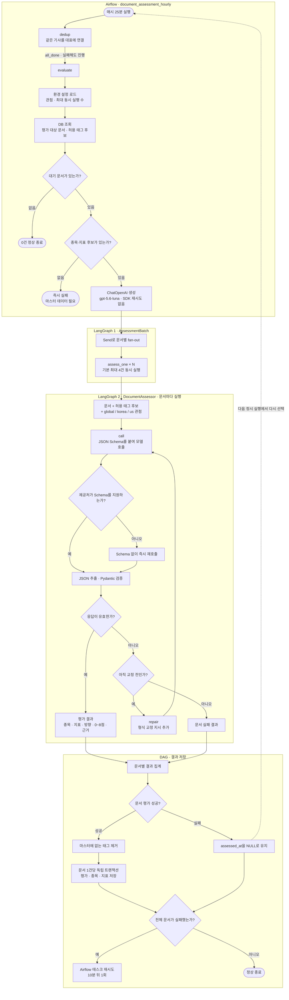

# 경제 문서 LLM 평가 워크플로우

`document_assessment_hourly`는 `dedup >> evaluate` 두 태스크다. `evaluate`가 두 개의 LangGraph를 실행하고,
LangChain의 `ChatOpenAI`로 gpt-5.6-luna를 호출한다.

실패한 문서는 삭제하거나 별도 상태로 바꾸지 않는다. 일부 문서만 성공하면 성공 건은 커밋하고,
실패 건은 다음 정시 실행에서 다시 평가한다. 모든 문서가 실패했을 때만 Airflow 태스크가 재시도된다.

## 구현 위치

- [Airflow DAG](../../airflow/dags/document_assessment_hourly.py)
- [배치 및 문서별 LangGraph](../../airflow/modules/assessment.py)
- [LangChain 모델 생성과 호출](../../airflow/modules/llm.py)
- [구조화 응답 Schema](../../airflow/modules/schema.py)
