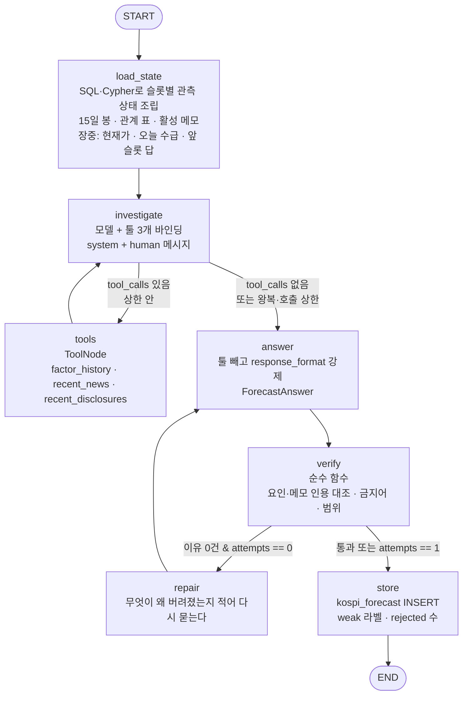
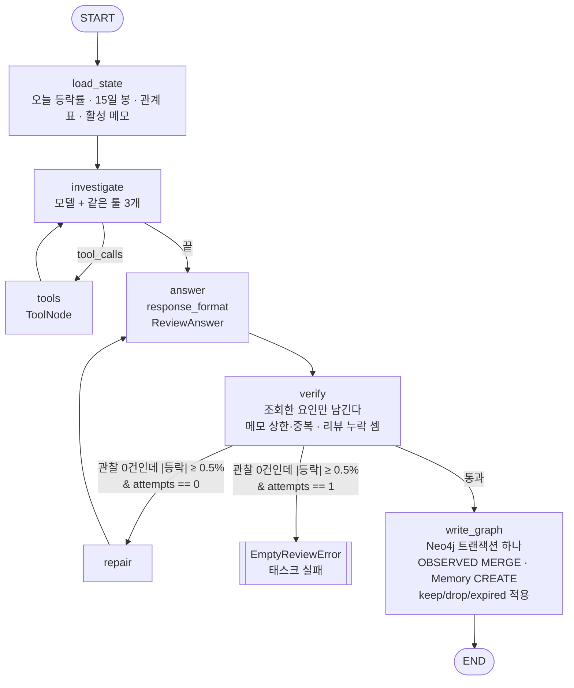

# 코스피 일일 전망 v2 — 관계 그래프·메모·툴 호출로 오늘의 등락을 말한다

- 날짜: 2026-09-02(작성), 2026-09-03(운영 기동·옛 기능 삭제)
- 상태: **운영 중.** 2026-09-03에 슬롯 셋과 관찰이 돌았고 채점까지 확인했다. 관계 그래프는
  8거래일(8/24~9/2)을 백필해 관측 34건이 쌓였다. 프롬프트 판 4.
  디버깅 노트북은 `notebooks/kospi_forecast_debug.ipynb`(`.gitignore` 대상).
- 대체 대상: 옛 시장 추론(`market_thesis_*`)과 주간 인과 그래프(`market_causal_weekly`).
  **둘 다 2026-09-03에 코드·문서를 지웠다** — 기록은 git 이력에 있다(삭제 직전 커밋
  `e04264f`). 표 열둘은 아직 데이터를 든 채 남아 있고 별도 리비전이 지운다. 경위는 §9.3.
- 산출물: `apps/models/analysis/kospi.py`(표 셋)와 수기 리비전 `a1c74f0b8e35`,
  `airflow/modules/kospi/`(`domain`·`state`·`tools`·`tool_args`·`tool_ledger`·`toolbox`·
  `graph`·`store`·`generation`·`common`·`run`·`forecast`·`intraday`·`review`·`render` 열다섯),
  `airflow/modules/prompts/kospi_forecast.yaml`·`kospi_review.yaml`,
  `airflow/sql/postgres/`의 `kospi_tools/` 여섯·`kospi_forecast/` 여덟·`kospi_llm_run/` 셋,
  `airflow/dags/kospi_forecast_daily.py`·`kospi_intraday_daily.py`·`kospi_review_daily.py`,
  `modules/llm.py`의 `kospi_model()`, 테스트 넷(`test_kospi_domain`·`test_kospi_pipeline`·
  `test_kospi_models`·`test_kospi_schema`, 99개). 저장소 전체는 2,336개.
- 관련 원본: [운영 안내](../operations.md), 수집 계약은 [collection/](../collection/),
  LLM 흐름 규칙은 `.claude/skills/writing-llm-flows/SKILL.md`.

## 0. 왜 새로 만드나

기존 시장 추론은 84건 채점에서 무작위 찍기와 성적이 같았다(Brier 0.668, 균등 추측 0.667,
2026-08-28 실측). 배포 뒤 70건으로 다시 재니 방향 적중이 32.9%였고 같은 구간의 "매일 상승"
기준선이 48.6%였다 — **기준선보다 아래였다.** 기능이 많았다 — 대상 넷, 툴 열다섯,
확률 셋, 지평 넷, 슬롯 다섯, 자유 어휘 그래프 — 그래서 무엇이 문제인지 가를 수 없었고, 8일에
프롬프트 판이 여덟 번 올라 어떤 변경의 효과도 재지 못했다.

**새 판은 작게 시작한다.** 코스피 하나, 툴 셋, 답은 "오른다/내린다 + 몇 % ± 몇 %"와 이유 목록.
슬롯은 셋(장전·장중·마감전)이지만 그래프 모양은 하나이고 슬롯은 값으로만 흐른다.
관계는 LLM이 장후에 관찰해 그래프에 쌓고, 가중치는 코드가 그 관찰에서 계산한다. 관계로
담기지 않는 것은 메모로 따로 두고 매일 검증해 지운다.

## 1. 확정 결정

| 항목 | 결정 | 근거 |
| --- | --- | --- |
| 대상 | **KOSPI 하나** | 사용자 결정. 성과가 보이면 늘린다 |
| 슬롯 셋 | **장전 08:35 · 장중 11:35 · 마감전 14:35** KST | 사용자 결정(2026-09-02). 아침 한 번으로는 개장 뒤 이슈·수급·가격 변화를 못 싣는다 |
| 예측 축 | 장전: **전일 KRX 종가 → 오늘 종가**. 장중·마감전: **그 시각 현재가 → 오늘 종가** | 사용자 결정. 장중 슬롯은 "지금부터 마감까지"를 묻는다. 정답 종가는 셋이 같고 분모만 다르다(§2.1) |
| 답의 모양 | 방향(up/down) + 기대 등락률 + ± 폭 + 이유 목록. **확률은 안 낸다** | 옛 판의 3-클래스 확률이 캘리브레이션 실패의 자리였다(`prob_flat` 0.31 vs 실제 13%) |
| 관계의 원천 | **LLM이 장후에 관찰**해 하루에 요인당 엣지 하나로 남긴다 | 사용자 결정 |
| 가중치 | **코드가 계산.** 최근 15관측의 (방향 × 세기)를 **반감기 5일로 감쇠 평균**. 옛 관측은 다 남기고 최신이 무겁다 | 모델은 값만 내고 판정은 코드가 한다. 관계가 뒤집히면 며칠 안에 가중치가 따라간다(§3.3) |
| 요인 어휘 | **코드 상수로 고정**(§3.1). 자유 생성 없음 | 요인마다 조회 툴이 있어야 전망이 값을 가져온다. 어휘가 열리면 툴 없는 요인이 생긴다 |
| 그래프 DB | **Neo4j가 관계·메모의 원본.** Postgres 관계 테이블 없음 | 사용자 결정. 인스턴스와 env는 이미 있다(`NEO4J_URI/USER/PASSWORD`) |
| 전망·원장 | Postgres 표 셋(§5) — 전망·대화 원장·툴 호출 | 채점이 `index_daily`와 SQL 조인이다 |
| 메모 | Neo4j `Memory` 노드. 상한 20, 나이 20일, 매일 유지/삭제 판정 | 사용자 추가(§4) |
| DAG 셋 | 장전 전망 · 장중 전망(슬롯 둘) · 장후 관찰 | 장전은 매크로 수집을, 장중은 봉·수급 스냅샷을 기다린다 — 앞단이 달라 나눈다. 장중 둘은 같은 것을 기다려 DAG 하나이고 슬롯은 Param → `logical_date` → 실패 순으로 정한다(§2.2) |
| 모델 | `grok-4.6` (`llm.kospi_model()`, `max_retries=0`) | 툴 왕복이 검증된 모델. 교체는 프롬프트 판과 함께 |
| 첫 성공본 불변 | 같은 `run_date`에 행이 있으면 모델을 다시 부르지 않는다 | 저장소 규칙 |
| 판 동결 | **20영업일** | 옛 판은 8일에 판 여덟으로 아무것도 못 쟀다 |

## 2. 하루가 이렇게 돈다

```
08:35 KST  [장전 전망]   kospi_forecast_daily   슬롯 pre_open
            보는 것: 최근 15영업일 시가·종가 / 관계 표 / 활성 메모 / 오늘 날짜
            툴로 보는 것: 밤사이 미국장·금리·환율(요인 값), 밤사이 뉴스·공시
            답: "오늘 코스피 전일 종가 대비 +1.2% ± 0.6%" + 이유 목록          → Postgres, Slack

09:00 KST  KRX 개장

11:35 KST  [장중 전망]   kospi_intraday_daily   슬롯 midday
            보는 것: 위 전부 + 오늘 장전 전망 + 시가·현재가·지금까지 등락
                     + 오늘 수급 스냅샷(외국인·기관·개인 누적) 최신
            툴로 보는 것: 개장 뒤 들어온 뉴스·공시, 요인 값
            답: "현재가 대비 마감까지 +0.4% ± 0.5%" + 이유 목록                → Postgres, Slack

14:35 KST  [마감전 전망] kospi_intraday_daily   슬롯 pre_close
            보는 것: 위 전부 + 오늘 앞 슬롯 둘의 답
            답: "현재가 대비 마감까지 -0.2% ± 0.3%" + 이유 목록                → Postgres, Slack

15:30 KST  KRX 마감
18:20 KST  kis_index_daily가 오늘 일봉을 index_daily에 넣는다 (기존 DAG)

19:00 KST  [장후 관찰]   kospi_review_daily
            ① grade_forecast (SQL만): 오늘 종가로 슬롯 셋을 채점             → Postgres
            ② observe_relations (LLM 한 번):
               - 오늘 무엇이 코스피를 움직였나  → OBSERVED 엣지               → Neo4j
               - 새 메모                       → Memory 노드                 → Neo4j
               - 기존 메모 유지/삭제 판정       → Memory 노드 갱신            → Neo4j
            ③ notify_slack: 슬롯별 채점 + 오늘 관찰 + 메모 변화              → Slack
```

시각 근거: 08:35는 매크로 수집(07:30~08:50)과 문서 평가(매시 25분) 뒤다. 11:35·14:35도 문서
평가 뒤라 :35다. 19:00은 `kis_index_daily`(18:20)와 투자자별 매매 확정(18:10) 뒤다. 전부 KST
cron이고 코드에는 UTC를 같은 줄에 병기한다. 하루 LLM 호출은 넷(전망 셋 + 관찰 하나)이다.

**모든 조회의 기준 시각은 벽시계가 아니라 `as_of_at`이다.** 슬롯이 정한다(08:35 / 11:35 /
14:35 / 19:00 KST). 배치가 밀려 실제로 늦게 돌아도 그 시각 뒤에 들어온 행은 보지 않는다.

### 2.1 슬롯마다 분모가 다르고 정답은 같다

| 슬롯 | 기준가(분모) | 정답 | 묻는 것 |
| --- | --- | --- | --- |
| `pre_open` 08:35 | 전일 KRX 종가(`index_daily`) | 오늘 KRX 종가 | 오늘 하루 |
| `midday` 11:35 | 그 시각 최신 분봉 종가(`index_bar`, `bar_at ≤ as_of_at`) | 오늘 KRX 종가 | 지금부터 마감까지 |
| `pre_close` 14:35 | 같은 방식 | 오늘 KRX 종가 | 지금부터 마감까지 |

- 기준가와 그 시각(`base_price`·`base_at`)을 행에 남긴다. 채점은 셋 다
  `actual = (종가 / base_price − 1) × 100`이고 방향 적중·폭 적중 정의도 같다.
- **슬롯끼리 성적을 직접 견주지 않는다.** 묻는 것이 다르다 — 마감 55분 전은 남은 움직임이
  작아 폭이 좁고 `flat`에 가깝다. 슬롯마다 자기 기준선과 견준다(§8).
- 장중 관측 상태에는 **"지금까지 등락"**(전일 종가 대비 현재가)을 따로 싣는다. 모델이 이미
  일어난 것을 남은 것으로 다시 세지 않게 프롬프트가 둘을 가른다.
- 장중 슬롯은 **오늘 앞 슬롯의 답**을 본다(장전 → 장중 → 마감전). 새 정보가 없으면 앞 답을
  이어가도 되고, 이유에 `slot_ref: pre_open`으로 인용할 수 있다.

### 2.2 장중 DAG는 슬롯을 시계로 정하지 않는다

`kospi_intraday_daily`는 cron 둘(`MultipleCronTriggerTimetable`)로 돌고, 슬롯은
① `Param(slot)` → ② `logical_date`의 시각이 슬롯 표와 정확히 일치 → ③ **실패** 순으로 정한다.
가까운 슬롯으로 반올림하지 않는다. 수동 Trigger가 벽시계로 떨어져 조용히 다른 슬롯을 도는 것이
2026-08-21의 교훈이었다. 슬롯 시각의 원본은 상수 하나(`INTRADAY_SLOT_TIMES`)이고 cron과 어긋나지
않게 테스트가 대조한다.

**준비 검사(readiness guard).** 최신 `index_bar`가 `as_of_at`에서 `BAR_STALENESS = 15분`보다
오래됐거나 오늘 수급 스냅샷이 없으면 태스크를 실패시킨다. 오래된 가격을 "지금"으로 읽고 답하는
것보다 안 도는 편이 낫다. 재시도는 Airflow가 한다(1회 × 5분).

## 3. 관계 — "A가 오르면 코스피가 이렇게 됐다" (Neo4j)

### 3.1 요인 목록 (코드 상수 `Factor`)

| 요인 | 코드 | 어디서 오나 (실측한 테이블) | 값의 단위 |
| --- | --- | --- | --- |
| 외국인 순매수 | `FOREIGN_NET_BUY` | `market_investor_flow_snapshot`(`market_code='KOSPI'`) 그날 **마지막 스냅샷**의 `foreign_net_buy_amount` | 원 |
| 기관 순매수 | `INSTITUTION_NET_BUY` | 같은 표 `institution_net_buy_amount` | 원 |
| 개인 순매수 | `INDIVIDUAL_NET_BUY` | 같은 표 `individual_net_buy_amount` | 원 |
| 미국 10년물 | `US10Y` | `quote_daily` 뷰 `symbol='US10Y'` | bp 차이 |
| 국고채 10년 | `KTB10Y` | `indicator_observation` `provider='ecos', series_id='KTB10Y'` | bp 차이 |
| 한은 기준금리 | `KRBASE` | `indicator_observation` `provider='ecos', series_id='KRBASE'` | bp 차이 |
| 원달러 | `USDKRW` | `quote_daily` | % |
| 달러인덱스 | `DXY` | `quote_daily` | % |
| S&P500 | `SP500` | `quote_daily` | % |
| 나스닥 | `NASDAQ` | `quote_daily` | % |
| 필라델피아반도체 | `SOX` | `quote_daily` | % |
| VIX | `VIX` | `quote_daily` | % |
| WTI | `WTI` | `quote_daily` | % |
| 삼성전자 | `SAMSUNG` | `stock_investor_trade_daily` `stock_code='005930'` 종가·외국인·기관 순매수 | %, 주 |
| SK하이닉스 | `SK_HYNIX` | `stock_investor_trade_daily` `stock_code='000660'` | %, 주 |
| 뉴스 | `NEWS` | `document`(평가 내장 `direction`·`value_score`·`assessment`) + `document_instrument`·`document_indicator` 태그 | — |
| 공시 | `DISCLOSURE` | `disclosure_event` `body IS NOT NULL` | — |

- 시장 단위 외국인 순매수는 **확정 일별 표가 없다.** 장중 누적 스냅샷의 마지막 값을 쓴다.
  확정치와 얼마나 다른지는 §9의 1에서 잰다.
- 금리는 퍼센트 변화가 아니라 **bp 차이**로 준다. 4.65 → 4.70을 +1.08%로 읽는 실수를 막는다.
- 요인을 더할 때는 이 표에 한 줄, `Factor`에 한 값, 툴 SQL의 요인→파일 매핑에 한 줄이다.

### 3.2 그래프 모양

```
(:Factor {code: 'FOREIGN_NET_BUY', name: '외국인 순매수'})
   -[:OBSERVED {date: 2026-09-01, sign: 'same', strength: 3,
                note: '외국인 1.2조 순매수가 반도체 중심 상승을 주도', llm_run_id: 41}]->
(:Index {code: 'KOSPI'})
```

- `sign` — `same`(요인이 오르면 코스피도 올랐다) / `inverse`(반대로 갔다).
- `strength` — 1·2·3. **3이 "주도했다"**, 1은 "같이 움직였지만 부차적".
- **하루에 요인당 최대 하나.** `MERGE (f)-[o:OBSERVED {date: $date}]->(i) ON CREATE SET ...` —
  같은 날 재실행은 덮지 않는다. 쌓이는 것이지 갱신되는 것이 아니다.
- 라벨은 옛 인과 그래프(`Event`·`Channel`·`Target`)와 겹치지 않는다. 옛것을 지울 때 새것이
  같이 지워지지 않는다.

### 3.3 가중치는 코드가 계산한다 — 최신 관측이 무겁다

옛 관측은 전부 남기되(§3.2, append-only) **가중치는 최근 것에 기울인다**(사용자 요구, 2026-09-02).
"외국인이 사면 올랐다"가 지난주까지 맞았고 이번 주 뒤집혔으면, 15일 단순 평균은 그 반전을
2주 뒤에야 보여 준다. 그래서 관측마다 나이에 따라 무게를 줄인다.

- **반감기 `RELATION_HALF_LIFE_DAYS = 5`**(달력일). 5일 전 관측은 오늘의 절반, 10일 전은 1/4.
  코드 상수 하나이고 시작값이다(§9의 5).
- **창 `RELATION_WINDOW = 15`관측.** 그 뒤 것은 안 본다 — 반감기 5일이면 15관측째는 무게가
  1/8 아래라 있으나 없으나 같다. 창을 두는 이유는 프롬프트 표가 아니라 계산 비용이다.

**Cypher는 관측을 주고 접는 것은 파이썬이 한다**(구현 중 결정, 2026-09-02). 처음에는 감쇠
평균까지 Cypher에 넣었는데, 그러면 이 저장소에서 그 식을 테스트할 수 없다 — 테스트가 실 DB를
쓰지 않기 때문이다. 지금은 조회가 창 안의 관측을 그대로 주고 `domain.relation_weight`가 접는다.

```cypher
MATCH (f:Factor)-[o:OBSERVED]->(:Index {code: 'KOSPI'})
WHERE o.date <= $as_of_date AND o.date >= $window_start
RETURN f.code AS code, o.date AS date, o.sign AS sign, o.strength AS strength,
       coalesce(o.note, '') AS note
ORDER BY code, date DESC
```

`$window_start`는 `as_of_date - RELATION_LOOKBACK_DAYS`(90일)다. 반감기 5일이면 90일 전
관측의 무게가 2^-18이라 값에 영향이 없고, 상한을 두는 이유는 그래프가 자란 뒤 한 번의
조회가 전 이력을 훑지 않게 하기 위해서다. 프롬프트에는 이렇게 실린다.

```
요인             가중치   관측   최근 방향        마지막      마지막 관찰
외국인 순매수     +0.80    12    같음·같음·같음   09-01      외국인 1.2조 순매수가 반도체 중심 상승을 주도
미국 10년물       -0.15     7    같음·반대·반대   08-29      금리 +8bp에도 반도체가 올랐다
VIX               -0.33     3    반대·반대·반대   08-26      VIX 급등에 위험자산 전반 약세
```

- `가중치`는 최신에 기운 값이고 `최근 방향`은 감쇠 없이 마지막 셋을 그대로 보인다. 둘을
  같이 주는 이유는 **가중치 하나로는 "오래 일관된 -0.5"와 "막 뒤집히는 중인 -0.15"가 구분되지
  않기** 때문이다. 미국 10년물 행이 그 예다 — 가중치는 아직 음수인데 최근 둘이 반대다.
- 프롬프트가 두 칸의 뜻을 밝힌다: "가중치는 최근 관측에 기울어 있다. 최근 방향이 가중치와
  어긋나면 관계가 바뀌는 중일 수 있다."
- 관측이 0인 요인은 표에 **"관측 없음"**으로 싣는다. 빈 칸은 "관계가 없다"가 아니라 "아직
  모른다"로 읽혀야 한다.

**같은 요인의 옛 관찰을 직접 보고 싶으면** `factor_history`가 아니라 그래프를 본다 — 툴로는
열지 않는다. 옛 관찰 문장은 "그때의 해석"이고 모델이 그것을 베끼면 사후확신이 순환한다.
필요해지면 `relation_history(factor)` 툴을 §9에 후보로 적고 그때 판단한다.

## 4. 메모 — 관계는 아니지만 다음에 봐야 할 것 (Neo4j)

"목요일 밤 미국 CPI 발표", "삼성전자 자사주 매입 공시 뒤 3일째 지지선 유지" 같은 자유 문장.
관계 엣지로 담기지 않지만 다음 전망이 알아야 하는 것이다. 사용자 추가(2026-09-02).

### 4.1 모양

```
(:Memory {id: 17, created_on: 2026-09-01, text: '목요일(09-04) 밤 미국 8월 CPI 발표',
          verify_count: 2, last_verified_on: 2026-09-02,
          retired_on: null, retire_reason: null, llm_run_id: 41})
   -[:ABOUT]-> (:Factor {code: 'US10Y'})        -- 선택. 요인과 관련 있을 때만
```

### 4.2 쓴다 — 장후 관찰 답변의 `memories`

- 0개 이상. `text` 200자 이내, `factor`는 목록 값이거나 `null`.
- **활성 메모 상한 `MAX_ACTIVE_MEMORIES = 20`.** 넘치면 새 메모를 쓰지 않고 원장에 센다
  (`memories_rejected`). 상한을 0으로 두면 기능이 꺼진다.
- 같은 문장(공백·문장부호 정규화 뒤 동일)은 버리고 센다.
- 자유 문장이라 **툴 결과와 대조할 ref가 없다.** 관계 관찰처럼 "조회한 요인만 남긴다"는 검사를
  못 한다. 그 자리를 상한(4.2)과 매일 검증(4.4)이 대신한다는 것을 알고 둔다.

### 4.3 읽는다 — 전망 슬롯 셋의 관측 상태

활성 메모(`retired_on IS NULL`) 전부를 `{id, created_on, text, factor, verify_count}`로 싣는다.
프롬프트가 밝힌다: **"이것은 사실이 아니라 지난 관찰의 메모다. 오늘 값과 맞지 않으면
무시하라."** 전망 이유가 메모를 근거로 쓰면 `reasons[].memory_id`로 인용한다. 활성 목록 밖
id는 버리고 센다.

### 4.4 검증하고 지운다 — 장후 관찰 답변의 `memory_reviews`

관측 상태에 활성 메모 전부를 싣고 **메모마다 하나씩** 판정을 받는다.

```
memory_reviews: [{id: 17, verdict: keep, reason: 'CPI 발표가 아직 안 왔다'},
                 {id: 12, verdict: drop, reason: '자사주 지지선이 오늘 -2.1%로 깨졌다'}]
```

코드가 적용한다.

| 경우 | 코드가 하는 것 |
| --- | --- |
| `keep` | `verify_count += 1`, `last_verified_on = today` |
| `drop` | `retired_on = today`, `retire_reason = <이유>` |
| 답에 빠짐 | `unreviewed_count += 1`. **두 번 연속이면** `retired_on = today`, `retire_reason = 'unreviewed'` |
| `created_on`이 **20일**보다 오래됨(`MEMORY_MAX_AGE_DAYS`) | LLM 판정과 무관하게 `retired_on = today`, `retire_reason = 'expired'` |

- **노드는 지우지 않는다.** `retired_on`과 이유가 남아 "무엇을 왜 지웠나"를 나중에 볼 수 있다.
- 나이 상한이 이 기능의 경계다. 메모는 "요즘 볼 것"이지 규칙이 아니다. 규칙이 되려면
  `OBSERVED` 엣지로 쌓여 가중치가 되어야 한다. 이 경계가 "LLM 출력이 LLM 입력이 되어
  스스로를 강화하는" 순환을 끊는다.
- 원장 칸 여섯: `memories_written · memories_rejected · memories_kept · memories_dropped ·
  memories_unreviewed · memories_expired`.

## 5. 전망과 원장 — Postgres 표 셋

### 5.1 `kospi_forecast` — 슬롯마다 한 행

| 컬럼 | 뜻 |
| --- | --- |
| `run_date` · `slot` | 예측한 날(KST)과 슬롯(`pre_open`/`midday`/`pre_close`, CHECK). 자연키 |
| `as_of_at` | 기준 시각(UTC) |
| `base_price` · `base_at` | 등락률의 분모와 그 값의 시각. 장전은 전일 종가·전일 15:30, 장중은 최신 분봉 종가·그 봉 시각 |
| `so_far_pct` | 장중만. 전일 종가 대비 현재가 등락률. 장전은 NULL |
| `direction` | `up` / `down`. CHECK |
| `expected_change_pct` | 기준가 대비 부호 있는 기대 등락률. CHECK `abs ≤ 10` |
| `band_pct` | ± 폭. CHECK `0.1 ≤ x ≤ 5` |
| `reasons` | JSONB. 검증을 통과한 이유 목록(§6.1). 순서가 중요도 |
| `input_state` | JSONB. 모델이 본 관측 상태 전부. **관계와 메모는 그래프가 원본이라 다음 날 바뀐다** — 이 칸이 없으면 그 전망이 무엇을 보고 나왔는지 못 되짚는다 |
| `weak` | 이유가 0건으로 저장된 약한 답이면 `true` |
| `rejected_reasons` | 검증이 버린 이유 수 |
| `llm_run_id` | FK → `kospi_llm_run` |
| `actual_change_pct` | 장후 채점. `(종가 / base_price − 1) × 100`. 처음 NULL |
| `hit` | 방향 적중. 처음 NULL |
| `within_band` | `abs(actual − expected) ≤ band`. 처음 NULL |
| `graded_at` | 채점 시각(UTC). 처음 NULL |
| `prompt_version` · `llm_model` · `dag_run_id` | 판·모델과 그 행을 쓴 실행 |

채점 칸 넷은 코드가 한 번 채운다. 사람이 UPDATE하는 경로는 없다. 틀린 전망은 틀린 채로 남는다.
같은 `(run_date, slot)`에 행이 있으면 모델을 다시 부르지 않는다.

### 5.2 `kospi_llm_run` — 모델 호출 하나에 행 하나

`id · kind(forecast|review) · run_date · slot(전망만) · status(running|succeeded|failed) · llm_model ·
prompt_version · dag_run_id · try_number · prompt_tokens · completion_tokens · reasoning_tokens ·
tool_calls · tool_rounds · truncated · rejected · memories_*(§4.4의 여섯) · started_at ·
finished_at · error`.

모델을 부르기 **전에** 별도 트랜잭션으로 `running` 행을 커밋하고, 어떻게 끝나든
(`except BaseException`, 다시 올린다) 닫는다. "안 돌았다"와 "돌다 죽었다"를 가르는 유일한 장치다.

## 6. LLM이 보는 것과 내는 것

슬롯 셋(장전·장중·마감전)이 같은 툴·같은 답변 스키마·같은 그래프를 쓴다. 다른 것은 관측
상태와 프롬프트 지시문뿐이다.

### 6.1 전망 — 슬롯 셋이 같은 그래프를 돈다

**관측 상태**(전부 코드가 SQL·Cypher로 만든다. Pydantic `frozen` 모델). 장전:

```
run_date: 2026-09-02 (수)   slot: pre_open   as_of: 2026-09-02 08:35 KST
base: 전일 종가 2,650.1 (09-01 15:30 KST)
bars (index_daily, KOSPI, 최근 15영업일):
  08-12  시가 2,611.3  종가 2,634.0  +1.12%
  ...
  09-01  시가 2,648.7  종가 2,650.1  +0.31%
relations: (§3.3의 표)
memories:  (§4.3의 목록)
```

장중·마감전은 여기에 넷이 는다:

```
slot: midday   as_of: 2026-09-02 11:35 KST
base: 현재가 2,672.4 (11:34 분봉)      so_far: 전일 종가 대비 +0.84%
today: 시가 2,661.0  고가 2,678.9  저가 2,655.2
flows_today (market_investor_flow_snapshot, 11:30 누적): 외국인 +4,120억  기관 -1,930억  개인 -2,050억
earlier_slots_today:
  pre_open 08:35  up  +1.2% ± 0.6%  이유 3건 (요약 한 줄씩)
```

- `bars`는 `index_daily`에서 `symbol='KOSPI' AND business_date < $run_date AND created_at <=
  $as_of_at ORDER BY business_date DESC LIMIT 15`다. 영업일 달력을 세지 않고 저장된 행 15개를
  쓴다. 15개 미만이면 태스크를 죽인다(빈 봉을 채우지 않는다).
- `base`·`today`는 `index_bar`의 그날 분봉(`bar_at ≤ as_of_at`)에서, `flows_today`는
  `market_investor_flow_snapshot`의 `observed_at ≤ as_of_at` 최신 행에서 온다. 장중 수급은
  툴이 아니라 관측 상태다 — 장중 슬롯의 핵심 입력이라 매번 툴로 부르게 두면 상한만 먹는다.
- `earlier_slots_today`는 `kospi_forecast`의 같은 날 앞 슬롯 행이다. 프롬프트가 "이것은
  오늘 앞선 시각의 판단이고 정답이 아니다"를 밝힌다.

**툴 셋**(호출할지는 모델이 정한다. `MAX_TOOL_CALLS = 15`, `MAX_TOOL_ROUNDS = 3`):

| 툴 | 인자 | 주는 것 |
| --- | --- | --- |
| `factor_history` | `factor: Factor`, `days ≤ 30` | 그 요인의 일별 값과 전일 대비 변화(단위는 §3.1). 요인의 자리별 SQL 파일 넷을 코드의 매핑이 고른다. 장중에는 수급 요인에 오늘 누적 행이 한 줄 더 붙는다 |
| `recent_news` | `hours ≤ 48`, `min_score 0~8` | 평가된 문서 상위 N — 제목·발행 시각·`direction`·`value_score`·태그·평가 요약 |
| `recent_disclosures` | `hours ≤ 48` | 본문 있는 DART 공시 — 회사·보고서명·접수 시각·본문 앞부분 |

셋 다 `as_of_at` 상한을 건다. `NEWS`·`DISCLOSURE` 요인은 `factor_history`가 아니라 뒤의 둘로
조회한다.

**답변 스키마 `ForecastAnswer`** (`response_format`으로 강제, 검증도 남긴다):

```json
{"direction": "up",
 "expected_change_pct": 1.2,
 "band_pct": 0.6,
 "reasons": [
   {"factor": "FOREIGN_NET_BUY", "memory_id": null, "direction": "up",
    "statement": "외국인이 3일 연속 순매수이고 어제 1.2조로 규모가 커졌다"},
   {"factor": "US10Y", "memory_id": null, "direction": "down",
    "statement": "10년물이 밤사이 +6bp 올라 반도체 밸류에이션에 부담"},
   {"factor": null, "memory_id": 17, "direction": "down",
    "statement": "목요일 CPI 앞두고 관망이 이어질 수 있다"},
   {"factor": null, "memory_id": null, "slot_ref": "pre_open", "direction": "up",
    "statement": "장전 판단 유지 — 개장 뒤 반박할 새 정보가 없다"}]}
```

- `reasons`는 **1개 이상이고 상한이 없다.** 코드도 스키마도 개수를 자르지 않는다 — 모델이 본
  것을 다 적게 두고 전부 저장한다(사용자 결정, 2026-09-02). 반대 방향 이유도 적을 수 있다.
  "왜 반대를 배제했나"가 기록의 절반이다.
- **순서가 곧 중요도다.** 프롬프트가 "결론에 가장 크게 작용한 것부터"로 정렬을 요구하고 배열
  순서를 그대로 저장한다. 별도 점수 칸은 두지 않는다 — 모델이 낸 숫자 하나가 더 늘면 검증할
  것도 하나 는다.
- **Slack만 자른다.** `SLACK_REASON_LIMIT = 3`으로 위에서 셋을 보이고 넘치면 `외 n건` 한 줄을
  붙인다. 표시 손잡이이지 저장 손잡이가 아니다. 전체는 DB(`reasons` JSONB)에 있다.
- `statement` 200자 이내. 투자 조언·매수매도 권유·목표가 금지(프롬프트 + 코드 금지어 검사).

**코드가 검사한다** (층마다 버린 수를 센다):

| 층 | 무엇을 막나 |
| --- | --- |
| 프롬프트 | 툴 결과·관측 상태에 없는 숫자를 쓰지 마라. 억지 인용이 근거 없음보다 나쁘다 |
| 파싱 | 스키마 밖 값, 범위 밖 숫자 → 교정 한 번 |
| 검증 | `factor`를 인용한 이유는 **이번 실행에서 그 요인을 툴로 조회했거나**(원장의 툴 호출 목록) **관측 상태에 있어야**(`bars`는 KOSPI 자신, `relations`에 관측이 있는 요인) 남긴다. `memory_id`는 활성 목록 안, `slot_ref`는 오늘 앞 슬롯이어야 한다. 아니면 버리고 `rejected_reasons`에 센다 |
| DB CHECK | 범위 폭주만 받는 안전망 |

이유가 **전부** 버려지면 교정을 한 번 더 묻는다. 그래도 0이면 `weak = true`로 저장하고 Slack에
머리표(`⚠ 근거 없는 답`)를 붙여 낸다. 정상 답과 같아 보이면 매일 읽는 사람이 이상한 날을
못 고른다.

### 6.2 장후 관찰

**관측 상태**: 오늘 등락률(전일 종가 대비) + 오늘 슬롯 셋의 전망과 채점 + 같은 15일 봉(오늘
포함) + 관계 표 + 활성 메모 전부. 툴은 같은 셋이고 `as_of_at`은 19:00 KST.

**답변 스키마 `ReviewAnswer`**:

```json
{"observations": [
   {"factor": "FOREIGN_NET_BUY", "sign": "same", "strength": 3,
    "note": "외국인 1.2조 순매수가 반도체 중심 상승을 주도"},
   {"factor": "US10Y", "sign": "inverse", "strength": 1,
    "note": "10년물 +6bp였지만 수급이 눌렀다"}],
 "memories": [
   {"text": "목요일(09-04) 밤 미국 8월 CPI 발표", "factor": "US10Y",
    "reason": "금리 민감 구간이라 다음 이틀 변수"}],
 "memory_reviews": [
   {"id": 12, "verdict": "drop", "reason": "자사주 지지선이 오늘 -2.1%로 깨졌다"}]}
```

- **툴로 조회하지 않은 요인의 관찰은 버리고 센다.** 관찰이 숫자를 봤다는 증거가 원장의 툴
  호출 목록이다.
- 오늘 `abs(actual_change_pct) ≥ 0.5%`인데 관찰이 0건이면 교정을 한 번 묻고, 그래도 0이면
  **태스크를 실패시킨다.** 움직인 날에 이유가 없는 것은 답이 아니다. 0.5% 미만이면 0건을
  허용하고 원장에 남긴다.
- `memories`·`memory_reviews`의 적용은 §4.2·§4.4.

## 7. LangChain·LangGraph 워크플로우

층 셋의 역할은 저장소 규칙 그대로다 — **LangChain**은 모델 호출(`ChatXAI`·메시지 타입),
**LangGraph**는 흐름 제어(노드·엣지·`ToolNode`), **Pydantic**은 데이터 모양(상태·툴 인자·답변).
`if`·`for`로 흩어 놓지 않고 노드 이름이 트레이스에 남게 한다.

### 7.1 전망(슬롯 셋 공통) — `ForecastBuilder`가 소유하는 그래프



- `investigate`에서 `tools`로 가는 조건은 "마지막 AI 메시지에 `tool_calls`가 있고 왕복이
  `MAX_TOOL_ROUNDS` 안"이다. 걸리면 `answer`로 넘기고 **원장에 `truncated = true`를 남긴다** —
  스스로 끝낸 조사와 잘린 조사가 같아 보이면 안 된다.
- **호출 상한(`MAX_TOOL_CALLS`)은 `truncated`에 안 잡힌다**(2026-09-03 확인). 그쪽은 툴 안에서
  `ToolLimitExceeded`가 되어 오류 `ToolMessage`로 모델에게 돌아가므로, 원장의
  `kospi_tool_call.error_kind = 'limit'` 행으로만 보인다. 둘을 같은 칸으로 세지 않는다 —
  왕복이 모자란 것과 호출이 모자란 것은 당길 손잡이가 다르다.
- `tools`는 `ToolNode(tools, handle_tool_errors=(ToolLimitExceeded,))`. DB 오류는 `ToolMessage`가
  되지 않고 올라가 태스크를 죽인다.
- `answer`는 같은 대화(`messages`)에 "이제 답하라"를 붙이고 툴을 뺀 모델로 부른다. 툴과 스키마를
  한 요청에 섞지 않는다.
- `verify`는 모델을 부르지 않는다. 검증 결과(남긴 이유·버린 이유·사유)를 상태에 쓴다.
- `repair`는 **한 번뿐**이다. 두 번째 실패는 `weak` 저장이고 재시도는 Airflow가 한다.
- 원장(`kospi_llm_run`)은 그래프 밖에서 연다 — `load_state` 전에 `running`을 커밋하고 그래프가
  어떻게 끝나든 닫는다.
- **슬롯은 값으로 흐르지 분기가 아니다.** 그래프 모양은 셋이 같고, 다른 것은 `load_state`가
  만드는 관측 상태(§6.1)와 프롬프트의 `instruction_pre_open`/`instruction_intraday` 둘뿐이다.
  노드 안에 `if slot == ...`를 두지 않는다 — 모드마다 다른 것은 슬롯별 모듈(`forecast.py`·
  `intraday.py`)이 갖고 공유 모듈은 슬롯을 모른다.

### 7.2 장후 관찰 — `ReviewBuilder`가 소유하는 그래프



- `write_graph`는 **Neo4j 세션 하나, 트랜잭션 하나**다. 관찰·새 메모·메모 판정이 반씩 들어가지
  않는다.
- 나이 상한 만료(`expired`)와 두 번 연속 `unreviewed`는 모델 답과 무관하게 `write_graph`가
  적용한다 — 코드가 정하는 것이지 판정이 아니다.
- 채점(`grade_forecast`)은 이 그래프 밖의 **SQL 태스크**다. LLM이 없다.

### 7.3 상태와 메시지

```python
class ForecastState(TypedDict):
    messages: Annotated[list[AnyMessage], add_messages]   # ToolNode가 이 모양으로 돌려준다
    observed: ObservedState                                # Pydantic frozen. 프롬프트 조립 한 번
    answer: ForecastAnswer | None                          # 검증 전 원본
    verified: VerifiedForecast | None                      # 남긴 이유 · 버린 이유와 사유
    attempts: int                                          # repair 횟수. 0 또는 1
    rounds: int                                            # 툴 왕복 수
```

- 프롬프트는 `prompts/kospi_forecast.yaml`의 `system`·`instruction`·`repair` 셋을
  `string.Template`으로 채운다. 숫자 상한(`MAX_TOOL_CALLS` 등)은 자리표시자다.
- 실행 하나에 `graph.invoke(state, config={"run_name": "kospi_forecast", "tags": [...],
  "metadata": {"run_date": ..., "prompt_version": ...}})`. 자격 증명은 안 넣는다.
- LangSmith 추적은 `LANGSMITH_*` 환경변수로만 켠다. **켜면 프롬프트와 툴 결과가 외부로 나간다.**

### 7.4 그래프 모양과 재사용

호출–교정 그래프는 저장소 기준형이다. 툴이 붙으므로 앞에 둘이 는다.

```
investigate → (조건부) tools → answer → (조건부) repair → answer
```

- `investigate`는 툴만 바인딩하고, `answer`는 툴을 빼고 `response_format`을 강제한다.
- `ToolNode(tools, handle_tool_errors=(ToolLimitExceeded,))` — 상한 초과만 모델에게 돌려주고
  DB 오류는 올려 태스크를 죽인다.
- 상태의 `messages`에 `add_messages` 리듀서. 그래프는 클래스가 생성자에서 한 번 `compile()`한다.
- 실행 하나에 `run_name`·`tags`·`metadata`(날짜, 판)를 붙인다. 자격 증명은 안 넣는다.

| 재사용 | 어디 |
| --- | --- |
| 모델 정의·오류 분류·토큰 집계 | `airflow/modules/llm.py` — `kospi_model()`을 더한다(지금 `thesis_model()`과 같은 정의) |
| YAML 프롬프트 읽기·치환 | `airflow/modules/prompt.py` |
| 응답 스키마 강제 | `airflow/modules/schema.py` |
| 툴 호출 기록 | `airflow/modules/thesis/tool_ledger.py`의 `ToolCallLedger` → `modules/kospi/tool_ledger.py`로 옮긴다(옛 폴더가 지워지므로) |
| Neo4j 드라이버 | `airflow/modules/graph/query.py`의 `driver()` 패턴과 env 셋 |
| Slack 발송 | `airflow/modules/slack.py` |

**새로 만드는 것**: `airflow/modules/kospi/` 여덟, 프롬프트 YAML 둘, SQL(툴 넷 + `bars` +
채점 + 원장 셋), 표 둘과 수기 리비전, DAG 둘, 테스트. Cypher는 `modules/kospi/graph.py`에
문자열 상수로 둔다(옛 `graph/cypher.py`와 같은 자리 규칙).

## 8. 기준선과 접는 조건 — 먼저 적는다

**전체 적중률을 방향 지표로 쓰지 않는다**(2026-09-03 결정). 이 시장은 상승이 61.4%라 아무
정보 없이 매일 `up`을 불러도 61%가 나온다. 정보는 **소수 클래스에서만 드러난다** — 모델이
하락이라 한 날 중 실제로 내린 비율이 무조건 하락 비율(38.6%)을 2×SE 넘어야 그때 처음
"방향을 안다"고 말한다. `notebooks/kospi_score.py`가 그것을 낸다.

**기준선. 전부 SQL이고 LLM이 없다. 슬롯마다 다르다.**

| 슬롯 | 기준선 |
| --- | --- |
| `pre_open` | ① 항상 상승(2026-08 표본 54%) ② 전일 방향 지속 |
| `midday` · `pre_close` | ① 지금까지 방향 지속(오전에 올랐으면 남은 구간도 `up`) ② 남은 구간 0(`expected = 0`, 폭만 채점) |
| 셋 공통 | 폭 적중률 60~80%가 시작 목표대 — 95%면 폭을 너무 넓게 부른 것이고 40% 아래면 반대 |

**옛 판의 경고를 적어 둔다.** 마감 30분 전 슬롯이 다섯 중 가장 나빴다(적중 17%, Brier 0.798)
이고 창이 짧을수록 `flat`이 늘었다(55분 창 83%). 14:35 슬롯이 같은 자리에 선다. 그래서
`pre_close`는 **자기 기준선 ②(남은 구간 0)를 못 이기면 가장 먼저 접는 슬롯**이다.

**판 동결 20영업일.** 그 사이 프롬프트 문장을 고치지 않는다. 버그는 코드로 고친다. 문장을
고쳐야 하면 판을 올리고 20일을 다시 센다.

**접는 조건은 슬롯 단위다.** 20영업일 뒤 그 슬롯의 방향 적중률이 자기 기준선 중 높은 쪽
**이하**이고 폭 적중률이 50% 미만이면 그 슬롯을 `FORECAST_SLOTS`에서 뺀다. 셋 다 빠지면
관찰(§3·§4)만 남긴다. 관찰 그래프는 전망 없이도 "무엇이 무엇과 움직였나"의 기록으로
값어치가 있다.

**읽는 쿼리**(운영 DB 읽기 전용):

```sql
-- A. 슬롯·판별 방향·폭 적중률 (판별 비교는 같은 슬롯끼리)
SELECT slot, prompt_version, count(*) AS n,
       round(avg(hit::int), 3) AS hit_rate,
       round(avg(within_band::int), 3) AS band_rate,
       round(avg(abs(actual_change_pct - expected_change_pct)), 3) AS mean_abs_error
FROM kospi_forecast WHERE graded_at IS NOT NULL
GROUP BY slot, prompt_version ORDER BY slot, prompt_version;

-- A2. 기준선 — 장전: 항상 상승 / 전일 방향 지속
SELECT round(avg((f.actual_change_pct > 0)::int), 3) AS always_up_rate,
       round(avg((sign(f.actual_change_pct) = sign(prev.actual_change_pct))::int), 3) AS persist_rate
FROM kospi_forecast f
JOIN LATERAL (SELECT actual_change_pct FROM kospi_forecast
              WHERE slot = 'pre_open' AND run_date < f.run_date AND graded_at IS NOT NULL
              ORDER BY run_date DESC LIMIT 1) prev ON true
WHERE f.slot = 'pre_open' AND f.graded_at IS NOT NULL;

-- A3. 기준선 — 장중: 지금까지 방향 지속 / 남은 구간 0
SELECT slot,
       round(avg((sign(actual_change_pct) = sign(so_far_pct))::int), 3) AS so_far_persist_rate,
       round(avg((abs(actual_change_pct) <= band_pct)::int), 3) AS zero_within_band_rate
FROM kospi_forecast WHERE slot IN ('midday', 'pre_close') AND graded_at IS NOT NULL
GROUP BY slot;

-- B. 약한 답·버린 이유 (조용한 성공 감시)
SELECT run_date, slot, weak, rejected_reasons, jsonb_array_length(reasons) AS reasons
FROM kospi_forecast ORDER BY run_date DESC, slot LIMIT 30;

-- C. 원장 — 잘림·실패·메모 통계
SELECT run_date, kind, slot, status, tool_calls, tool_rounds, truncated,
       memories_written, memories_dropped, memories_expired, memories_unreviewed
FROM kospi_llm_run ORDER BY run_date DESC, kind, slot;
```

```cypher
// D. 요인별 관측 분포 — 한 번도 안 나오는 요인은 툴에서 뺀다
MATCH (f:Factor)-[o:OBSERVED]->(:Index {code: 'KOSPI'})
RETURN f.code, count(o) AS n, avg(o.strength) AS avg_strength,
       sum(CASE o.sign WHEN 'same' THEN 1 ELSE 0 END) AS same, count(o) - same AS inverse
ORDER BY n DESC
```

## 8.5 2026-09-03 실측과 그날의 변경

운영 슬라이스를 개발 DB에 옮기고, 관찰 4일을 채우고, 장전 전망 1회를 돌린 뒤 얻은 것이다.

### 잰 것

| 무엇 | 값 | 뜻 |
| --- | --- | --- |
| 항상 상승 | **61.4%** (81/132) | 이겨야 할 기준선. 50%가 아니다 |
| 전일 방향 지속 | 50.4% | 모멘텀 없음. 기준선으로 쓸모없다 |
| \|등락\| 중앙값 / p90 | 2.27% / 6.49% | 변동성이 크다. 폭 상수가 여기 맞아야 한다 |
| 상승·하락 중앙값 | +2.11% / −3.25% | 하락이 크고 드물다 → 뉴스가 하락에 시끄럽다 |
| 전일 SOX → 오늘 방향 | **68.8%** | 유일하게 기준선을 넘는 요인(1.7σ) |
| 전일 US10Y·WTI·USDKRW → 오늘 방향 | 51 / 50 / 52% | 방향에 잡음. 관계 그래프가 0으로 수렴해야 한다 |
| 미국 종가 도착 | 07:35 KST | 08:35 전망이 본다. 백필 구간(8/28 134행)은 예외 |
| 뉴스 감성 → 방향 | **미측정** | 문서가 18일치라 표본 12일. 결론 없음 |

### 고친 것

- **미래 누수**(가장 큰 것). 관계·메모를 날짜로 잘라 같은 날 저녁 관찰이 그날 아침 전망에
  보였다. `created_at`으로 자르고, `created_at`을 벽시계가 아니라 `as_of_at`으로 쓴다.
  회귀 테스트 넷.
- **크기 기준선**(판 2). 모델이 중앙값 2.27% 시장에 폭 1.00을 불렀다. 250봉 분위수와
  방향별 중앙값을 `moves` 블록으로 준다.
- **폭 문장 정정**(판 3). 판 2에 "폭이 중심값보다 크면 뜻이 없다"고 썼는데 틀렸다. 방향을
  완벽히 맞혀도 필요한 폭이 2.5~2.9%p이고 기대 크기가 약 2.0이라, 이 시장에서는 폭이 중심을
  넘어야 정상이다. 닷새 백테스트(판 2)에서 폭이 1.4~1.8로 눌려 **폭 적중 = 방향 적중 =
  2/5**가 됐다 — 방향이 틀리면 폭도 못 맞히는 구조였다. 튜닝이 아니라 잘못 쓴 문장을
  바로잡은 것이라 동결 전에 고쳤다.
- `MAX_TOOL_CALLS` 8 → 15. 첫 실행이 정확히 8을 썼고 요인이 15개다.
- **툴 원장이 전부 거짓이었다.** 인자 스키마에 `InjectedToolCallId` 칸을 빠뜨려 래퍼가 기록을
  못 찾았고, 백테스트 69회가 전부 `validation` 오류·결과 0자로 적혔다(실제 결과 JSON은
  `error` 칸에). 툴도 모델도 정상이라 태스크는 성공이었다 — **원장만 조용히 틀리는 종류**다.
  칸을 넣고 `toolbox.run()`이 결과를 남기는지 테스트로 잠갔다.
- 시장 단위 수급을 금액이 아니라 **수량**으로. 금액 칸의 단위가 미확정이다.
- 채점 지표를 방향별 정밀도로(§8).

### 본 것

- 모델의 숫자는 이틀 11개 전부 DB와 일치했다. 환각 0.
- 메모 수명이 잘 돈다 — 9건 중 6건을 타당한 이유로 내렸고 낡은 것을 갱신된 것으로 바꿨다.
- **조용한 날에 게으르다.** 코스피가 ±0.5% 안이면 삼성·하이닉스만 보고 끝냈다(3일 연속
  관찰 2건). 관계가 그만큼 느리게 쌓인다.
- 삼성·하이닉스는 지수의 구성 요소라 언제나 `같음`이다. 정보량이 없는데 관측이 가장 빨리
  쌓여 표를 지배할 것이다.
- `factor=None`인 이유가 무조건 통과한다. 뉴스 주장이 `NEWS` 요인 없이 살아남는다.

## 8.6 구현 현황 — 문서와 코드의 대조 (2026-09-03)

**문서가 약속한 동작 중 코드에 없는 것을 적는다.** 없으면 다음 사람이 있는 것으로 읽는다.

| 문서가 말한 것 | 코드 | 비고 |
| --- | --- | --- |
| 슬롯 셋, 기준가 축, 준비 검사 (§2) | 있음 | |
| 관계 엣지·감쇠 가중치·창 (§3) | 있음 | 집계는 Cypher가 아니라 파이썬(§3.3) |
| 메모 쓰기·읽기·판정·만료·미검토·상한 (§4) | 있음 | |
| 표 셋과 채점 한 번 (§5) | 있음 | |
| 이유 검증 — 요인·메모·앞 슬롯·금지어 (§6.1) | 있음 | |
| **이유가 전부 버려지면 한 번 되묻기** (§6.1) | **2026-09-03 추가** | 그 전에는 `weak`로 바로 저장했다. 되물을 때 버린 사유를 싣는다 |
| **큰 날 관찰 0건이면 한 번 되묻기** (§6.2) | **2026-09-03 추가** | 그 전에는 되묻지 않고 바로 죽였다 |
| 그래프 모양 — 조사·툴·답·교정 (§7) | 있음 | |
| 기준선·방향별 정밀도·읽는 쿼리 (§8) | **`notebooks/kospi_score.py`** | `.gitignore` 대상. 자동 발송 없음 |
| 관계 수렴·메모 회전 (§10 20영업일) | **`notebooks/kospi_relations.py`** | 같음 |
| 백테스트 (§10 배포 전) | **`notebooks/kospi_backtest.py`** | 같음 |
| `factor=None` 이유의 출처 검증 | **없음** | §9.2의 5. 뉴스 주장이 요인 없이 통과한다 |
| 조용한 날 관찰 커버리지 | **없음** | §9.2의 6. 프롬프트 문장뿐이고 코드 장치가 없다 |
| ops 브리핑·Slack 자동 지표 | **없음** | 20영업일 판정은 사람이 스크립트를 돌린다 |

**평가 도구 셋이 저장소 밖(`notebooks/`)에 있다.** 손으로 돌리는 도구라는 관례를 따랐고
DAG도 서비스도 import하지 않는다. 20영업일 판정이 반복될 것 같으면 그때
`airflow/modules/kospi/report.py`로 올려 테스트를 붙이고 ops 브리핑에 싣는다 — 지금은 한 번
볼 것이라 안 옮겼다.

## 9. 남은 확인

구현하면서 잰 것과 아직 안 잰 것을 가른다.

### 9.1 구현이 답한 것

- **시장 단위 수급의 단위가 확정돼 있지 않다**(2026-09-02 실측). `market_investor_flow_snapshot`
  의 `*_net_buy_amount`는 모델 주석이 "단위 미확정"이다(`stock_investor_trade_daily` 쪽은
  백만원으로 확정). 그래서 **요인 값을 수량(주)으로 바꿨다** — 금액은 툴이 원문 그대로 함께
  주되 단위를 주장하지 않는다. 확정 일별 표가 없는 것은 그대로라 날마다 마지막 스냅샷을 쓴다.
- **가중치 집계를 Cypher에서 파이썬으로 옮겼다**(§3.3). 감쇠 식을 DB 없이 테스트하기 위해서다.
- **삼성전자·SK하이닉스의 코스피 비중은 필요 없다**(사용자 확인). 두 종목은 종가와 수급만 본다.
- **Airflow 컨테이너의 Neo4j 접속은 이미 설정돼 있다**(사용자 확인).

### 9.2 아직 안 잰 것

1. **마지막 스냅샷과 KRX 확정 외국인 순매수의 차이.** 며칠 대조해 크면 확정 일별 수집을
   붙이거나 종목 합산으로 바꾼다. 운영 DB 읽기 전용.
2. **툴 SQL 여섯을 운영 DB에 한 번 돌려 본다.** 테스트는 가짜 연결을 쓰므로 컬럼 이름과 조인
   조건이 틀려도 통과한다 — 이 확인이 2026-08-21에 결함 둘을 잡았다. 노트북 3절이 그 자리다.
3. **장중 준비 검사가 정상인 날 막지 않는지.** `BAR_STALENESS` 15분이 실제 지연 분포 안인지
   운영 로그로 본다.
4. **프로토타입.** 노트북으로 **관찰 3영업일 → 전망 슬롯 셋 1일**을 돌린다. 둘째·셋째 날
   검증이 메모를 실제로 지우는지, 관계 표가 프롬프트에 어떻게 실리는지, 장중 슬롯이 앞 슬롯
   답을 베끼기만 하는지 본다. **한 번만 돌리면 "누적되며 이어지는가"를 못 본다.**
5. **`factor=None` 이유의 검증.** 관측 상태에서 읽은 것과 뉴스 주장을 코드가 못 가른다.
   요인을 필수로 만들고 관측 상태용 값 하나를 두면 닫힌다.
6. **조용한 날의 관찰 커버리지.** 프롬프트의 "조용한 날은 관찰이 없어도 된다"가 "대충 해도
   된다"로 읽힌다. 20영업일 쌓인 뒤 관측 1건 요인이 여전히 많으면 손댄다.
7. **삼성·하이닉스를 요인에서 뺄지.** 지수 구성 종목은 원인이 아니라 부분이다.
8. **시작값들.** 메모 상한 20·나이 20일, 툴 상한 15회·3왕복·12만 자, 관찰 0건 허용 임계 0.5%,
   `BAR_STALENESS` 15분, 관계 반감기 5일·창 15관측·조회 90일, 모델 타임아웃 900초.
   **실측 없음.** 프로토타입 뒤 조정하고 근거를 여기 적는다.

### 9.3 옛것의 삭제 (2026-09-03 실행)

**둘을 함께 지웠다.** 옛 시장 추론(`market_thesis_*` 넷)과 주간 인과 그래프
(`market_causal_weekly`)다. 인과 그래프는 사용자가 이 날 "이것도 안 쓴다"로 정했다.

**한 커밋에 넣을 수밖에 없었다** — 둘이 서로를 물고 있었다.

    thesis → causal   `thesis/common.py`가 `market_causal_direction/select_for_thesis.sql`을 읽는다
    causal → thesis   `models/analysis/causal.py`가 `thesis_llm_run.id`로 외래키를 둘 건다

어느 쪽을 먼저 지워도 다른 쪽이 import에서 죽는다. 그래서 순서를 나누는 대신 커밋을 셋으로
갈랐다 — ① 빌려주던 부품 되찾기 ② 코드·문서 삭제 ③ 표 drop 리비전.

**부품 둘이 다른 기능에 빌려져 있었다**(①에서 옮겼다).

| 무엇 | 어디로 | 왜 |
| --- | --- | --- |
| `ThesisDirection` | `technical.SignalDirection` | `technical_signal.direction`이 쓴다. 이름만 thesis였다. `FLAT`은 이 표에 들어간 적이 없어 함께 뺐다 |
| `DART_VIEWER_URL` | `briefing/disclosures.py` | 공시 원문 링크 문자열. 쓰는 데가 거기 하나다 |

`classify_outcome`·`FLAT_THRESHOLD_PCT`는 안 옮겼다 — 소비자가 `technical/base_rate.py`
하나였고 그것도 추론 전용이라 같이 지웠다.

**②에서 지운 것**(코드 약 28,000줄): DAG 다섯, `modules/thesis/`·`causal/`·`graph/`,
`technical/base_rate.py`, 프롬프트 넷, 모델 둘, API 리소스(`thesis` 넷 + 쓰는 쪽이 0이 된
`repository/common.py`·`service/common.py`), SQL 57개, 테스트 20파일,
`docs/analysis/market-thesis/` 21개와 `market-causal-graph.md`.

**고친 것**: `briefing/ops.py`(추론 채점·적체 절), `modules/llm.py`(모델 함수 넷과
`THESIS_TIMEOUT_SECONDS`), 모델 패키지 `__init__` 둘, API 배선, README, `docs/README.md`,
`docs/operations.md`.

**옮긴 테스트 둘.** `test_dag_module_attributes.py`와 `test_import_weight.py`는 지운 기능만
재고 있었지만 담긴 교훈이 새 기능에도 그대로라 kospi로 옮겼다. **후자가 옮기자마자 사실
하나를 드러냈다** — `kospi/store.py`가 `modules.llm`에서 `TokenUsage`를 가져오는데 그
모듈이 LangChain을 끌고 와서, 슬롯 모듈 넷이 202개를 문다. 옛 추론이 파일을 여섯으로
가르며 피했던 형태다. 삭제와 다른 손잡이라 고치지 않고 테스트가 그 상태를 잠근다
(`test_the_kospi_slot_modules_still_carry_langchain`).

**③은 아직 안 했다.** 표 열둘이 3,250행을 든 채 남아 있다.

| 표 | 행 |
| --- | --- |
| `thesis` · `thesis_outcome` · `thesis_evidence` | 118 · 263 · 931 |
| `thesis_llm_run` · `thesis_precedent` · `thesis_tool_call` | 69 · 552 · 1,105 |
| `market_event` · `market_channel` | 11 · 9 |
| `market_causal_path` · `step` · `evidence` · `direction` | 51 · 78 · 57 · 6 |

`technical_signal.rule_version`의 컬럼 주석이 아직 `thesis.prompt_version`을 가리킨다.
**DB 주석이라 모델만 고치면 autogenerate가 매번 `COMMENT ON` 차이를 낸다** — ③의 리비전에서
함께 고친다.

**로컬 DB는 테스트 중 전부 지우고 다시 만들어도 된다. 운영 DB는 절대 지우지 않는다.**
Neo4j 옛 라벨(`Event`·`Channel`·`Target`)은 코스피 백필 전에 이미 비웠다.

## 10. 배포 순서와 무엇을 언제 보나

### 배포 전 — 끝난 것

- 백테스트 닷새(판 2 → 판 3). 폭 적중 2/5 → 3/5, 폭 1.56 → 2.82%p. 판 3이 고치려던 것을 고쳤다.
- 툴 SQL 열하나를 운영에 읽기 전용으로 확인(2026-09-02, 실패 0).
- DagBag import 47개 전부 통과. 새 DAG 셋의 표시 이름·스케줄·태스크·Param 확인.
- README를 새 기능에 맞춰 고쳤다(DAG 48, 하루 흐름, 파이프라인 절, 테스트 수).
- `notify` Param을 DAG 셋에 붙였다 — 아래 3번이 운영 채널을 도배하지 않게.

### 배포 — 사용자가 한다

1. **커밋·머지.** 워크트리 `feature-kospi-forecast`. `notebooks/` 셋은 `.gitignore`라 안 간다.
2. **리비전 반영.** `just migrate upgrade head` — `a1c74f0b8e35` 하나가 올라간다. 옛 표는
   안 건드린다.
3. **코드 배포.** `airflow/`가 바인드 마운트라 파일이 올라가면 DAG 셋이 뜬다. 새 환경변수는
   없다(`XAI_API_KEY`·`NEO4J_*`·`SLACK_*` 전부 이미 있다).
4. **관찰 백필 — 이게 제일 중요하다.** 운영 Neo4j는 비어 있고 **관계 없는 전망은 기능의
   절반이다.** `kospi_review_daily`를 `run_date`를 주고 `notify=false`로 날마다 트리거한다.
   시작일은 **2026-08-18**이 맞다 — 문서가 8/17부터 있어 그 앞은 뉴스·공시 툴이 빈다.
   영업일 12일 = LLM 12회. `grade_forecast`는 채점할 것이 없어 0건으로 지나간다(정상).
   **운영 Neo4j는 `bolt://neo4j:7687`이라 컨테이너 밖에서 못 붙는다 — 노트북이 아니라 DAG로
   해야 한다.**
5. **옛 DAG pause.** `market_thesis_*` 넷. 새 것이 하루 돈 뒤에.

### 배포 뒤 — 판 3을 얼린다

**20영업일 동안 프롬프트를 고치지 않는다.** 고치면 표본이 갈린다. 버그는 코드로 고친다.

| 언제 | 무엇을 보나 | 어디서 |
| --- | --- | --- |
| 매일 | 돌긴 도나 — 준비 검사·타임아웃·Slack | Airflow |
| 1주 | 툴 호출이 15에 붙나(`error_kind='limit'`), 조사 잘림 | `kospi_llm_run` |
| **20영업일** | **폭 적중 60~80%.** 관계 수렴 — US10Y·WTI 가중치가 0 근처로, SOX가 양수로 가나. 메모 회전 | `kospi_score.py`, **`kospi_relations.py`**(궤적·커버리지·메모 회전) |
| 60영업일 | 하락 호출 정밀도 vs 38.6% | `kospi_score.py` §④ |
| 120영업일 | 전체 방향 vs 61.4%. 여기서 처음 접을지 정한다 | 같은 곳 |

**관계 수렴이 첫 증거다.** 방향 적중률보다 훨씬 빨리, 훨씬 분명하게 나온다. 20일 뒤 그
표가 아무 것도 수렴하지 않으면 이 설계의 핵심 가정이 틀린 것이고, 그때 접는다.
