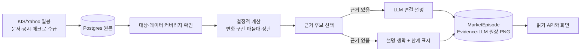

# MarketEpisode — 일봉 기반 시장 구간 설명 설계

- 날짜: 2026-08-27
- 상태: **미구현. 이 문서는 구현 계약이다.**
- 목표: 일봉 차트의 주요 가격 변화와 일봉 기반 추정 매물대, 시장·경제·수급 근거를 한 시점축에
  묶어 "무엇이 함께 일어났고 어떤 해석이 가능한가"를 설명한다.
- 관련 원본:
  [기술지표](market-technical-indicators.md),
  [시장 추론](market-thesis/README.md),
  [LLM 실행 원장](market-thesis/13-llm-ledger.md),
  [경제 문서 아카이브](economic-document-archive-design.md)

## 0. 확정 결정

| 항목 | 결정 |
| --- | --- |
| 분석 단위 | **일봉** |
| 저장 모델 | 기존 `Thesis`에 넣지 않고 별도 `MarketEpisode`를 둔다 |
| API | 기존 FastAPI에 읽기 전용 `/api/market-episodes`를 추가한다 |
| 초기 대상 | 삼성전자 `005930`, SK하이닉스 `000660`, `KOSPI` |
| 대상 확대 | `KOSPI` + 국내 `instrument.is_watched` 종목. 종목 코드를 코드에 계속 추가하지 않는다 |
| 원시 일봉 확보 | 최근 **7년**. 이미 있는 더 오래된 행은 지우지 않는다 |
| 한 번의 분석 범위 | 기본 1년, 최대 **3년** |
| 매물대 | 체결·틱 기반이 아닌 **일봉 OHLCV 기반 추정 매물대** |
| 실행 | Airflow 수동 실행 + 장후 자동 탐지 |
| LLM 역할 | 이미 계산된 수치와 등록된 근거를 연결하고 설명한다. 수치 계산과 원인 확정은 하지 않는다 |
| 인과 표현 | `사실`·`동시 관찰`·`가능한 해석`을 구분한다. 검증 없이 "원인이다"라고 단정하지 않는다 |

`Thesis`는 세션 슬롯별 전망·장후 리뷰이고 확률과 사후 채점을 갖는다. `MarketEpisode`는 과거의
임의 구간을 설명하고 가격대·변화 구간·근거 연결을 갖는다. 두 개를 합치면 `Thesis`의
`run_date/run_slot/subject` 자연키와 확률·채점 계약이 모두 흐려지므로 모델과 API를 분리한다.

초기 지수는 사용자 범위대로 `KOSPI` 하나다. 기존 기술지표·thesis가 `KOSPI`와 `KOSDAQ`을
함께 다루는 계약은 바꾸지 않으며, `MarketEpisode`만의 의도적인 초기 범위 예외다.

## 1. 사용자에게 보이는 결과

한 `MarketEpisode`는 대상 하나와 구간 하나에 대해 다음을 제공한다.

1. 확정 일봉 차트와 주요 상승·하락 구간 표시
2. POC와 지지·저항 후보를 겹친 **일봉 추정 매물대**
3. 같은 구간의 시장 지수·환율·금리·수급 변화와 문서·공시 근거
4. 각 가격 변화와 근거의 연결 설명
5. 근거가 부족하거나 데이터가 불완전한 부분

예를 들어 "급락 뒤 반등"을 보여 줄 때 가격 수익률, 저점, 반등 폭은 코드가 계산한다. LLM은
`movement:m1`과 `document:123`처럼 전달받은 식별자를 연결해 "당시 방역 충격 보도와 급락이
같은 기간에 관찰됐다"고 설명한다. 유동성 공급 발표가 있으면 발표 사실은 근거로 인용하되,
그 발표가 반등의 유일한 원인이라고 단정하지 않는다.

## 2. 범위와 제외 범위

### 2.1 이번 구현에 포함한다

- 일봉 가격 변화 구간 추출
- 일봉 OHLCV 기반 POC·고거래 가격대와 지지·저항 후보 계산
- 대상 수익률과 시장·경제 시계열의 동행 정도 계산
- 평가된 문서, DART 공시, 기술 신호, 수급·매크로 관측값을 변화 구간에 연결
- 근거가 있을 때만 LLM 설명 생성
- 결과·인용 근거·LLM 실행 이력·PNG 차트 저장
- 목록·상세·PNG 읽기 API
- 수동 분석 DAG와 장후 자동 탐지

### 2.2 이번 구현에서 만들지 않는다

- 틱·분봉 체결가별 정확한 Volume Profile
- 주문·매수/매도 추천·목표가
- 장중 급변 탐지. 기존 `market-thesis` 문서에서 제외한 분 단위 탐지기는 그대로 제외한다
- 7년 전체를 한 화면이나 한 LLM 요청에 싣는 기능
- 과거 뉴스 전량 백필 또는 출처가 정해지지 않은 웹 검색 수집기
- Neo4j 투영과 별도 관계 그래프 API
- 분석 결과 수정 UI와 공개 생성 API
- 새 차트 라이브러리, 벡터 DB, 별도 분석 서비스, 작업 큐

수동 생성은 기존 운영 방식대로 Airflow가 담당한다. 현재 FastAPI는 읽기 전용이므로 인증·요청
제한 없이 `POST /api/market-episodes`를 추가하지 않는다. 화면에서 직접 생성해야 하는 요구가
생길 때 인증과 작업 상태 API를 함께 설계한다.

## 3. 시간과 데이터 커버리지 계약

### 3.1 7년 수집과 3년 분석은 서로 다른 값이다

- **수집 창 7년**: 신규 대상의 최초 백필 목표다. 더 오래된 기존 행을 삭제하는 보존 정책이 아니다.
- **분석 창 최대 3년**: 한 episode에서 가격 변화와 매물대를 계산하는 상한이다.
- **기본 수동 창 1년**: 파라미터에 시작일이 없을 때 사용한다.
- **자동 차트 창 120거래일**: 최신 변화가 보이는 범위다.
- **자동 매물대 창 최대 3년**: 화면보다 앞선 거래 이력도 지지·저항 후보 계산에는 사용한다.

국내 거래일을 연 250일로 잡으면 7년은 종목당 약 1,750행이다. 현재 KIS 종목 일봉 원천인
`stock_investor_trade_daily`는 한 요청에 30거래일이므로 처음 한 번 약 59회, 두 종목 약
118회다. 기존 페이지 간 0.5초 대기만 계산하면 약 1분이고 저장 행도 수천 건이라 초기 세 대상의
7년 백필은 문제가 되지 않는다. 중요한 규칙은 **매일 7년을 다시 받지 않는 것**이다. 최초 백필
뒤 일상 실행은 대상당 최근 한 페이지만 겹쳐 받는다.

**백필은 새 설계가 아니라 기존 DAG의 운영 절차다.** `kis_investor_trade_daily`가 이미
`end_date`·`pages` Param과 `walk_back`으로 30거래일씩 뒤로 걷고, 페이지마다 기존 종가와
대조해 어긋나면 그 페이지를 저장하지 않고 멈춘다(`airflow/dags/kis_investor_trade_daily.py`의
`walk_back`). 이 기능에서 새로 만들 수집 코드는 없다.

새 관심종목도 해당 종목만 최신일부터 과거로 한 번 백필한다 — `end_date`를 비우고
`pages≈59`로 수동 트리거하는 것이 전부다. 최신 3년이 채워지면 분석 가능한 것으로 보고,
나머지 4년은 같은 멱등 upsert로 이어서 채운다. 별도 readiness 컬럼은 두지 않고
최소일·최대일·KRX 개장일 결측 조회로 판단한다. 두 번으로 나눌 때는 최신일부터 약 25페이지로
3년을 먼저 채우고, 두 번째 실행은 저장된 최저일의 전날을 `end_date`로 주어 이전 구간만 걷는다.

**수집 하한은 2018-12-10이다.** `BACKFILL_START_DATE = IDENTITY_EPOCH`이고 그 앞은 KIS 투자자
항등식이 깨져 아예 받지 않는다(`modules/collectors/market/kis_investor_flow.py`의
`IDENTITY_EPOCH` 주석). `pages`를 크게 줘도 거기서 멈춘다. 7년 목표는 항상 그 하한보다 뒤라
지금 제약이 되지 않지만, 하한이 있다는 사실이 여기 없으면 "왜 더 안 내려가나"를 코드에서 찾게 된다.

### 3.2 한 episode의 시각

| 이름 | 뜻 |
| --- | --- |
| `window_start` / `window_end` | 사용자에게 보이는 가격 분석 구간. 둘 다 KRX 거래일 |
| `profile_start` | 매물대 계산에 실제 사용한 첫 거래일. `window_end`에서 최대 3년 전 |
| `analysis_as_of_at` | 분석 실행과 근거 조회의 상한인 UTC 시각 |
| `published_at` | 문서·공시가 발표된 시각 |

가격 봉은 반드시 `business_date <= window_end`이고 `created_at <= analysis_as_of_at`이어야 한다.
자동 실행의 `analysis_as_of_at`은 해당 장후 실행 시각이다. 수동 실행은 실행 시각을 쓰므로 나중에
알려진 설명 자료를 볼 수 있지만, 결과가 **사후 분석**임을 API와 화면에 표시한다.

`analysis_as_of_at`은 태스크 재시도마다 `now()`로 다시 만들지 않고 Airflow DAG run에 한 번
고정한다. 같은 실행을 재시도하는 동안 입력 cutoff가 움직이지 않아야 멱등 키도 유지된다.

문서 후보는 각 주요 변화 구간의 시작 3일 전부터 끝 5 KRX 영업일 뒤까지만 본다. 또한
`published_at <= analysis_as_of_at`을 강제한다. 가격보다 뒤에 나온 해설을 썼다면 그 발행 시각을
그대로 표시해 동시 정보와 사후 설명을 구분한다.

### 3.3 과거 문서의 실제 한계

현재 `document_ingestion_hourly`가 만든 문서 아카이브는 2026-08부터이고 RSS는 그 이전 전체
기사를 돌려주지 않는다. 따라서 가격 일봉이 3년 있어도 과거 사건 설명 근거가 3년 있는 것은
아니다. 각 결과는 다음 값을 낸다.

| `evidence_coverage` | 규칙 | 동작 |
| --- | --- | --- |
| `sufficient` | 모든 주요 변화 구간에 인용 가능한 문서·공시 또는 출처가 있는 공식 발표가 있음 | LLM 설명 생성 |
| `partial` | 일부 변화 구간만 근거가 있음 | 확인된 구간만 설명하고 나머지는 제한사항에 적음 |
| `insufficient` | 인용 가능한 외부 근거가 없음 | LLM을 부르지 않고 가격·매물대·상관 수치만 제공 |

숫자 데이터가 있다는 이유로 LLM이 과거 사건명을 기억에서 채우게 하지 않는다. 코로나 사례는
이 기능의 개념 예시지만 2026년 기준 최대 3년 분석 범위 밖이다. 이를 실제 분석하려면 분석 상한
확대와 신뢰 가능한 과거 문서 출처가 모두 필요하며 MVP에는 넣지 않는다.

따라서 3년은 **수치 분석 상한**이지 3년 전체의 사건 설명을 보장하는 기간이 아니다.
`macro_change`·`investor_flow` 같은 계산 관측만 있는 구간은 동행 수치는 보여도 외부 사건 근거가
있는 것으로 세지 않는다. `sufficient`·`partial` 판정에는 출처 링크가 있는 문서·공시·공식 발표만
사용한다.

## 4. 대상 선택과 관심종목 확대

대상 결정의 원본은 한 곳뿐이다.

```sql
SELECT ticker, name
FROM instrument
WHERE is_watched
  AND market IN ('kospi', 'kosdaq')
  AND kind = 'equity';
```

여기에 고정 지수 `KOSPI`를 합친다. 초기 데이터는 자연스럽게 `005930`, `000660`, `KOSPI`가
되지만, 이후 국내 관심종목은 `instrument` 행과 `quote_symbol` 카탈로그를 준비한 뒤
`is_watched=true`로 바꾸면 같은 흐름에 들어온다. 해외 watched 종목은 KIS 국내 종목 API에
보내지 않는다.

현재 `kis_investor_trade_daily`는 `InvestorFlowStock` enum 두 개를 순회한다. 첫 배포는 이미
수집되는 두 종목과 KOSPI로 기능 가치를 확인한다. 관심종목 확대 단계에서 이 고정 순회를 위 SQL의
국내 watched 결과로 바꾸고, 수동 백필에는 선택적인 `stock_codes` 파라미터를 추가한다. 자동
실행은 전체 watched 종목을 한 페이지씩 받고, 신규 종목의 7년 백필은 그 종목만 지정해 운영 시간
밖에 실행한다. 새 일봉 수집기는 만들지 않는다.

대상이 늘어날 때 비용은 다음처럼 제한한다.

- 일봉 수집·수치 계산은 대상 수에 선형으로 늘지만 DB 계산뿐이다.
- 자동 LLM은 매일 모든 대상을 분석하지 않고 6절의 후보가 생긴 대상만 부른다.
- 한 대화에 후보를 최대 10개까지 넣는다. 더 많으면 10개 단위로 나누며 Airflow pool로 동시성을
  제한한다.
- 한 대상 실패는 다른 대상의 계산·저장을 되돌리지 않는다.

분산 큐나 별도 캐시는 지금 만들지 않는다. 일별 수집의 p95 실행 시간이 다음 스케줄 간격의
절반을 넘거나 KIS 429/초당 제한 오류가 실행의 1%를 넘을 때 대상별 task mapping과 호출 속도
손잡이를 추가한다.

## 5. 데이터 흐름



재사용하는 원본과 코드는 다음과 같다.

| 필요 값 | 재사용 원본 |
| --- | --- |
| 정규화 일봉 | `airflow/sql/postgres/technical/select_history.sql`의 **모양만** 새 파일에 복사 (아래) |
| 일봉 값 객체 | `airflow/modules/technical/indicators.py`의 `DailyBar` |
| 기술 신호 | `technical_signal`과 `technical_signal_daily` |
| 차트 | `airflow/modules/briefing/chart.py`의 Matplotlib 설정·색·한글 폰트 규칙 |
| 문서·공시·매크로·수급 | 기존 `ThesisToolbox`가 읽는 원본 테이블과 SQL 매핑 방식 |
| LLM 호출 | `airflow/modules/llm.py`의 구조화 응답 호출 |
| 실행 감사 | `thesis_llm_run`·`thesis_tool_call` |
| API 구조 | 기존 repository → service → route와 dependency-injector 패턴 |

**`select_history.sql`을 그대로 쓸 수 없다.** 그 파일은 `limit`(최근 N봉)만 받고
`window_start..window_end` 구간을 못 받는다. 재사용하는 것은 **모양**이다 — `quote_daily` 뷰와
`stock_investor_trade_daily`를 한 컬럼 이름으로 UNION하는 방식, `created_at <= as_of_at` cutoff,
`include_watched` 확장. 그것을 episode 전용 SQL 파일에 복사하고 `WHERE business_date BETWEEN ...`로
바꾼다. 기존 파일에 파라미터를 더하면 브리핑과 신호 DAG가 쓰지 않는 값을 매번 넘겨야 하고,
한쪽을 고칠 때 다른 쪽이 조용히 따라 바뀐다(저장소 규칙: 툴을 늘릴 때 조회 SQL은 새 파일로 만든다).

현재 `ThesisToolbox`의 `recent_documents(hours)`와 다른 최근값 툴은 슬롯 직전 몇 시간용이라
과거 구간 조회에 그대로 쓸 수 없다. 그 툴의 공개 인자를 3년으로 넓혀 기존 thesis의 프롬프트
표면을 바꾸지 않는다. `MarketEpisode`는 날짜가 고정된 읽기 SQL로 근거 후보를 먼저 만들고,
`<kind>:<id>` ref 형식과 원장 저장 흐름만 재사용한다. `investor_flow` 등 새 종류가 있으므로
episode evidence enum·DTO는 별도로 둔다. 첫 구현에서 공통 base toolbox나 별도 에이전트
프레임워크를 만들지 않는다.

## 6. 결정적 분석 규칙

LLM 호출 전에 이 절의 값이 모두 확정돼야 한다. 같은 입력과 `analysis_version`이면 같은 결과가
나와야 한다.

### 6.1 입력 검증

- `window_start <= window_end`
- 표시 구간은 최대 3년
- 유효 OHLCV가 60봉 미만이면 `insufficient_bars`로 종료
- OHLC 관계(`low <= open/close <= high`)와 음수가 아닌 거래량 검증
- 인접 종가 변화가 35%를 넘으면 수정주가 경계 가능성이 있으므로 변화·매물대·상관·LLM을
  계산하지 않고 `price_gap` 제한사항만 남김. KIS 수정주가 재백필 가드는 기존 수집 흐름을
  그대로 사용
- `volume IS NULL` 또는 전부 0이면 가격 변화는 계산하되 매물대는 `unavailable`

`insufficient_bars`는 수동 실행이면 입력 오류로 실패하고, 자동 실행이면 해당 대상만 건너뛴다.
`price_gap`은 차트로 데이터 이상을 확인할 수 있도록 episode를 저장하지만 `narrative`는 NULL이다.

### 6.2 주요 가격 변화 구간

수동 구간에서 LLM에 750개 일봉을 그대로 주지 않는다.

**조회는 `window_start`의 20거래일 전부터 한다.** `close[t] / close[t-20]`은 구간 시작 뒤 20봉이
지나야 첫 값이 나오므로, 표시 구간만 읽으면 구간 앞머리의 큰 움직임이 조용히 사라진다.
lead-in 봉은 수익률 계산에만 쓰고 **선택 대상은 `window_start..window_end` 안에서 끝나는 구간뿐**이다.
lead-in이 모자라면(상장 초기 등) 있는 만큼만 쓰고 그 사실을 제한사항에 남긴다.

1. 각 거래일의 20거래일 수익률 `close[t] / close[t-20] - 1`을 계산한다.
2. 절댓값이 큰 순서로 고르되 이미 선택한 끝 날짜와 20거래일 안이고 **방향도 같으면** 같은
   움직임으로 보고 건너뛴다. 같은 20거래일 안의 급락과 반등은 둘 다 남긴다.
3. 최대 6개를 선택한 뒤 날짜순으로 정렬한다.
4. 각 구간에 `movement:m1` 형태의 키, 시작·끝·방향·수익률·고가·저가·최대 낙폭을 붙인다.

이는 완전한 시장 국면 분류기가 아니라 설명할 만한 큰 움직임을 줄이는 규칙이다. "상승장",
"하락장" 같은 장기 regime 모델은 만들지 않는다. 반복 지지·저항과 횡보 여부는 아래 가격대
반응으로 별도 표현한다.

### 6.3 일봉 추정 매물대

계산 창은 `profile_start..window_end`의 최대 3년이다.

1. 전체 `min(low)..max(high)`를 같은 폭의 **24개 가격 bin**으로 나눈다.
   모든 가격이 같아 폭이 0이면 bin 하나에 전체 거래량을 넣고 POC만 낸다.
   **거래량이 양수인 bin이 5개 미만이면 매물대를 `unavailable`로 내린다.** 3년 창에서
   이상치 한 봉이 `min`·`max`를 늘리면 실제 거래가 소수 bin에 뭉쳐 POC와 지지·저항이
   가격대가 아니라 그 한 봉을 가리킨다. 값이 없다고 말하는 편이 낫다.
2. 일봉의 `low..high`가 걸치는 bin 수를 센다. 고가와 저가가 같으면 해당 bin 하나다.
3. 그날 거래량을 걸친 bin에 균등 배분한다. 일봉 안 실제 체결 분포를 안다고 가정하지 않는다.
4. 누적 거래량이 가장 큰 bin을 POC로 정한다. 동률이면 `window_end` 종가에 가까운 bin,
   다시 동률이면 낮은 가격을 택한다.
5. 거래량이 0보다 큰 bin만 놓고 `bin_volume >= max(80백분위, 중앙값 × 1.5)`인 bin을
   고거래 bin으로 고르고, 인접한 bin은 하나의 고거래 가격대로 합친다. 양수 bin이 하나뿐이면
   별도 고거래 가격대 없이 POC만 남긴다.
6. 기준 종가 아래에서 가장 가까운 고거래 가격대 또는 POC를 지지 후보, 위에서 가장 가까운
   것을 저항 후보로 정한다. 종가가 가격대 안이면 `inside_value_area`로 표시하고, 그 가격대를
   지지와 저항으로 동시에 쓰지 않고 다음 바깥 가격대를 찾는다.

최근 60거래일에 가격대 반응을 확인한다.

- 지지 반응: 저가가 가격대에 닿거나 관통한 뒤 종가가 가격대 상단 위에서 끝남
- 저항 반응: 고가가 가격대에 닿거나 관통한 뒤 종가가 가격대 하단 아래에서 끝남
- 연속 접촉은 한 번으로 세고 가격이 한 bin 이상 떠났다가 다시 닿아야 새 반응으로 셈
- 반응 2회 이상: `reaction_state=repeated`, 1회: `observed`, 0회: `untested`
- 가격대 경계에서 `max(반 bin 폭, 가격대 중간값의 1%)` 이상 바깥으로 종가가 2거래일 연속
  끝나면 `break_state=broken_up` 또는 `broken_down`, 아니면 `intact`

이 값은 체결가별 매물대가 아니다. API·차트·LLM 프롬프트에서 항상 **"일봉 추정 매물대"**로
표시한다. "거래가 많이 기록된 가격대라 반응 후보가 된다"까지만 말하며 그 가격대가 향후
가격을 반드시 지지하거나 막는다고 말하지 않는다.

### 6.4 시장·경제 동행 수치

고정 비교 후보는 일봉 수집이 이미 있는 `KOSPI`, `USDKRW`, `SP500_FUT`, `NASDAQ100_FUT`,
`SOX`, `VIX`이고 대상 자신은 뺀다. 실제로 일봉이 있는 계열만 계산한다.

- 종가가 아니라 일간 수익률을 사용한다.
- 국내 날짜는 같은 KRX 거래일로 맞춘다.
- 미국 세션은 해당 세션 뒤 처음 열리는 KRX 거래일에 대응시킨다.
- 공통 관측이 60개 미만이면 상관계수를 내지 않고 표본 부족을 표시한다.
- Pearson 상관계수와 관측 수, 시작·끝 날짜를 함께 저장한다.
- API는 60개 이상 결과를 보여 주되 LLM에는 관측이 120개 이상이고 구간 전반부·후반부의
  상관 부호가 같은 계열만 준다. 그중 절댓값 상위 3개만 입력한다.

상관계수는 동행을 말할 뿐 원인을 증명하지 않는다. 이벤트 스터디는 사건 전후 반응을 비교하는
정식 방법이지만, 대조군·기대수익·오염 사건을 통제하지 않는 이번 MVP는 인과효과를 계산하지
않는다.

### 6.5 장후 자동 후보

자동 DAG는 KIS 일봉과 `technical_signal_daily`, 20:25 문서 평가가 끝난 뒤 **KST 평일
21:00**에 돈다. 가격 선행 데이터는 readiness guard로 확인하고, 문서가 없다는 이유만으로
실행을 실패시키지는 않는다.

대상별로 다음 중 하나면 그날 episode 후보가 된다.

- 최신 일간 수익률이 직전 60개 일간 수익률 평균에서 표준편차 3배 이상 벗어남
- 당일 새 `technical_signal`이 있음
- **두 돌파일을 제외한 이전 봉**으로 고정한 6.3절 가격대를 종가가 2거래일 연속 돌파 또는
  이탈함

표준편차가 0이거나 60개 수익률이 없으면 첫 규칙은 쓰지 않는다. 여러 조건이 동시에 맞아도
대상·종료일당 episode 하나만 만들고 `trigger_reasons` 배열에 모두 남긴다. 자동 episode의
표시 구간은 최근 120거래일, 매물대 계산은 최대 3년이다.

## 7. 근거 선택과 LLM 계약

### 7.1 근거 후보

각 `movement:*` 구간에 다음 후보를 최대 5개씩 붙인다.

- `document`: 평가가 끝난 문서. 종목이면 `document_instrument` 일치 문서를 우선하고,
  시장 공통 문서를 보충한다
- `disclosure`: 해당 종목의 DART 공시
- `macro_change`: 비교 시계열의 같은 구간 수익률·금리 변화
- `technical_signal`: 구간 안에 저장된 기술 사건
- `investor_flow`: 종목 또는 KOSPI의 같은 구간 외국인·기관·개인 누적 순매수

문서는 기존 가치 점수, 대상 일치, 변화 구간과의 시간 거리를 순서대로 사용해 고른다. 후보의
제목·URL·발행시각·계산 상세는 `input_state`에 스냅샷으로 남긴다. 최종 응답이 실제로 인용한
항목만 `market_episode_evidence`에 저장한다.

**`input_state`에 문서 본문을 넣지 않는다.** 제목·URL·발행시각·계산 상세만 넣고 문자열 칸마다
상한을 둔다. 본문은 `document.body`에 이미 있고, 여기 복사하면 같은 원문이 episode 수만큼
jsonb로 늘어난다. `LANGSMITH_*`를 켜면 프롬프트가 외부로 나간다는 기존 규칙과도 짝이다.

### 7.2 LLM 입력과 출력

LLM에는 원시 일봉 전체 대신 다음만 준다.

- 대상·분석 시각·가격 구간
- 최대 6개 `movement` 수치
- POC·지지·저항 후보와 반응 횟수
- 6.4절 안정성 조건을 통과한 상관계수 상위 3개와 관측 수
- 구간별 근거 후보와 `ref`
- `evidence_coverage`와 알려진 제한사항

구조화 출력은 다음 모양이다.

```json
{
  "summary": "전체 구간 요약",
  "links": [
    {
      "movement_key": "movement:m1",
      "relation": "association",
      "evidence_refs": ["document:123"],
      "explanation": "해당 하락 구간과 같은 시기에 수요 둔화 우려가 확인됐다."
    }
  ],
  "level_notes": [
    {
      "level_key": "level:support:1",
      "explanation": "반복 반응이 관찰된 고거래 가격대다."
    }
  ],
  "uncertainties": ["과거 기사 커버리지가 일부 기간에 없다."]
}
```

`relation`은 `fact`, `association`, `hypothesis`만 허용하고 `cause`는 스키마에 두지 않는다.
상관 수치만으로 `association`을 쓰려면 6.4절의 120개·부호 안정 조건을 통과해야 한다.
저장 전 다음을 검증한다.

- 존재하지 않는 `movement_key`·`level_key`·`evidence_ref` 제거
- 인용 근거가 없는 `fact`를 `hypothesis`로 낮춤
- 입력에 없는 가격·수익률·날짜 등 숫자를 쓴 응답 거절
- `insufficient`인데 생성된 원인 설명 거절
- 구조 오류는 정확히 한 번만 교정 요청하고, 다시 실패하면 LLM 설명 없이 결정적 결과만 저장

사용자 화면의 가격·수익률·상관계수는 LLM 문장에서 파싱하지 않고 `input_state`의 계산값으로
그린다.

### 7.3 기존 LLM 원장 재사용

새 원장 테이블을 만들지 않고 `thesis_llm_run`과 `thesis_tool_call`을 재사용한다.

- `LlmRunKind`와 DB CHECK에 `market_episode` 추가
- `market_episode` 실행의 `run_date = window_end`, `horizon_days = NULL`
- episode에는 thesis 슬롯이 없으므로 `run_slot`을 nullable로 바꾸고
  `kind = 'market_episode'`일 때만 NULL을 허용
- `ThesisLlmRun.run_slot`, 원장 INSERT SQL, `ThesisStore.start_llm_run()`의 `run_slot` 인자를
  nullable로 바꾸고, 기존 네 kind는 반드시 non-NULL이라는 조건부 CHECK를 둠
- 한 자동 대화가 후보 여러 개를 설명할 수 있으므로 여러 `market_episode.llm_run_id`가 같은
  원장 행을 가리킬 수 있음
- 근거 후보를 코드가 먼저 고르는 MVP에서는 tool call이 0개일 수 있음. 이것도 사실 그대로
  원장에 남김

`thesis_llm_run`이라는 기존 이름은 바꾸지 않는다. 이름을 일반화하거나 원장 테이블 두 개를
복제하는 대신 위 세 계약을 명시적으로 확장한다. 기존 thesis 호출자는 계속 non-NULL 슬롯을
보내므로 동작은 바뀌지 않는다. thesis 밖 소비자가 더 늘어 이름이 실제 운영 혼란을 만들 때
마이그레이션한다.

조건부 제약의 핵심은
`(kind = 'market_episode' AND run_slot IS NULL AND horizon_days IS NULL) OR
(kind <> 'market_episode' AND run_slot IS NOT NULL)`이다. 기존 status·horizon 제약은 유지한다.

## 8. 저장 모델

### 8.1 `market_episode`

| 컬럼 | 타입 | 계약 |
| --- | --- | --- |
| `id` | bigint PK | 내부 식별자 |
| `subject_kind` | text CHECK | `index` / `stock` |
| `subject_code` | text | `KOSPI` 또는 6자리 종목코드. 마스터 FK 없음 |
| `label` | text | 분석 시점 표시 이름 스냅샷 |
| `window_start`, `window_end` | date | 표시·변화 분석 구간 |
| `profile_start` | date | 매물대 계산 시작일 |
| `trigger_kind` | text CHECK | `manual` / `automatic` |
| `trigger_reasons` | jsonb | 자동 조건 또는 수동 요청 정보 |
| `analysis_as_of_at` | timestamptz | 입력·근거 cutoff |
| `analysis_version` | text | 결정적 계산 판 |
| `prompt_version` | text | LLM 프롬프트 판. LLM 생략 시에도 예정 판을 기록 |
| `input_hash` | text | OHLCV·비교 시계열·근거 후보를 정규화한 분석 입력 SHA-256 |
| `input_state` | jsonb | 변화·매물대·상관·근거 후보의 불변 스냅샷 |
| `evidence_coverage` | text CHECK | `sufficient` / `partial` / `insufficient` |
| `narrative` | jsonb nullable | 7.2절의 검증된 구조화 출력 |
| `limitations` | jsonb | 데이터 부족·가격 갭·LLM 생략 사유 |
| `chart_png` | bytea | 생성 시점의 재현 가능한 PNG. **지연 로드 컬럼이다** |
| `chart_alt_text` | text | 대상·구간·핵심 변화·가격대를 담은 대체 텍스트 |
| `llm_run_id` | bigint nullable FK | `thesis_llm_run.id`, 삭제 시 NULL |
| `dag_run_id` | text | 작성 실행 |
| `created_at` | timestamptz | 생성 시각 |

자연키는 `(subject_kind, subject_code, window_start, window_end, analysis_version,
prompt_version, input_hash)`다. `INSERT ... ON CONFLICT DO NOTHING`으로 **같은 입력의** 첫
성공본을 보존한다. 수정주가 재반영이나 새 근거 유입으로 입력이 달라지면 새 snapshot이 생기고,
규칙 자체가 바뀌면 판을 올린다. `trigger_kind`를 키에 넣지 않아 같은 입력·구간의 수동·자동
중복을 막는다. hash에는 실행 시각 자체를 넣지 않는다.

**`input_hash`의 정규화 규칙을 여기서 정한다.** 규칙이 없으면 같은 입력이 실행마다 다른 해시를
내고, 그 순간 §12.3의 "자연키 재실행은 LLM을 다시 부르지 않는다"와 §12 완료 시나리오 2번이
거짓이 된다. 재실행 비용을 정하는 값이라 구현자 재량으로 두지 않는다.

1. 해시 대상은 `input_state`와 같은 Pydantic 모델이다.
2. `model_dump(mode="json")`으로 편다. `Decimal`이 문자열로 나가 부동소수 표기가 흔들리지 않는다.
3. `json.dumps(..., sort_keys=True, separators=(",", ":"), ensure_ascii=False)`로 직렬화한다.
4. utf-8로 인코딩해 SHA-256을 낸다.

`analysis_version`·`prompt_version`은 자연키에 이미 있으므로 해시 본문에 넣지 않는다.

`chart_png`는 API 앱이 Airflow 모듈과 Matplotlib을 import하지 않고 그대로 응답하기 위해 DB에
둔다. 목록·상세 JSON에는 싣지 않고 PNG endpoint만 읽는다. 별도 object storage는 만들지 않는다.

**모델에서 이 컬럼을 지연 로드로 선언한다**(`mapped_column(LargeBinary, deferred=True)`).
"목록에 PNG를 싣지 않는다"는 **응답 모양** 이야기라, 리포지토리가 엔티티를 불러오면 bytea는
그대로 메모리에 올라온다 — `MAX_LIMIT=200` × 150KB이면 응답에 안 실리는 30MB를 매 요청 읽는다.

용량 임계는 숫자로 둔다. 120봉 2단 PNG가 약 150KB이므로 대상 3개면 연 약 110MB,
watched 20개로 늘리면 연 약 750MB다. DB 백업 시간이나 PNG 조회 지연이 실제로 문제가 될 때
이 컬럼만 object storage key로 바꾼다.

필수 제약과 인덱스:

- `window_start <= window_end`, `profile_start <= window_end`
- 위 자연키 UNIQUE
- 목록용 `(subject_kind, subject_code, window_end DESC)` 인덱스
- `llm_run_id` 인덱스

### 8.2 `market_episode_evidence`

| 컬럼 | 타입 | 계약 |
| --- | --- | --- |
| `id` | bigint PK | 내부 식별자 |
| `episode_id` | bigint FK | `market_episode.id`, 삭제 시 CASCADE |
| `movement_key` | text | `movement:m1` 또는 전체 설명이면 `episode` |
| `rank` | integer | 같은 movement 안 인용 순서, 1부터 |
| `evidence_kind` | text CHECK | `document`, `disclosure`, `macro_change`, `technical_signal`, `investor_flow` |
| `evidence_ref` | text | 원본 또는 계산 근거 식별자 |
| `relation` | text CHECK | `fact`, `association`, `hypothesis` |
| `title`, `url`, `published_at` | nullable snapshot | 당시 사용자에게 보여 준 출처 정보 |
| `mechanism` | text | 이 근거를 해당 움직임에 연결한 검증된 설명 |
| `detail` | jsonb | 방향·값·기간 등 출처별 상세 |

UNIQUE는 `(episode_id, movement_key, evidence_kind, evidence_ref)`와
`(episode_id, movement_key, rank)` 두 개다. 원본 테이블로 FK를 걸지 않는다. 원문이 없어져도
당시 무엇을 근거로 썼는지가 남아야 한다.

**`url`은 저장 시 `http`·`https` 스킴만 허용하고 아니면 `NULL`로 둔다.** 값의 출처가 크롤링한
피드라 우리가 만든 문자열이 아니고, 화면은 이 스냅샷을 그대로 링크로 그린다.

가격 구간과 레벨은 행별 조회·갱신 대상이 아니므로 별도 테이블을 만들지 않고 `input_state`에
둔다. 실제 조회 요구가 생기기 전에 정규화하지 않는다.

## 9. DAG와 실패 처리

### 9.1 `market_episode_analysis`

하나의 DAG가 수동과 자동을 함께 처리한다.

| 파라미터 | 자동 기본값 | 수동 계약 |
| --- | --- | --- |
| `subject_code` | NULL: 전체 허용 대상 | 단일 대상 코드. 허용 대상 밖이면 외부 호출 전에 실패 |
| `start_date` | NULL: 최근 120거래일 | `YYYY-MM-DD`, 비우면 종료일 기준 1년 |
| `end_date` | 최신 확정 KRX 거래일 | `YYYY-MM-DD` |
| `force_candidate` | false | true면 자동 탐지 조건 없이 요청 구간을 분석 |

자동 실행은 `force_candidate=false`로 6.5절 후보만 만든다. 수동 실행은 명시한 대상을 분석하므로
`force_candidate=true`로 취급한다. 휴장일 자동 실행은 skip하고, 수동 구간은 과거 거래일로
정규화한다. 시작·끝이 3년을 넘으면 잘라내지 않고 입력 오류로 실패시킨다.

태스크 순서는 다음뿐이다.

1. 대상과 일봉 커버리지 확인
2. 대상별 결정적 계산과 근거 후보 생성
3. **`input_hash`를 내고 자연키로 기존 행을 조회한다.** 있으면 그 대상은 LLM도 PNG도
   건너뛰고 기존 `id`를 결과로 낸다
4. 남은 후보를 최대 10개씩 LLM 구조화 호출
5. 대상별 PNG 렌더링과 episode·evidence 저장

**3단계가 재실행 비용을 정한다.** `ON CONFLICT DO NOTHING`은 저장 자리의 방어일 뿐이라,
그 앞에서 확인하지 않으면 이미 있는 결과를 만드느라 LLM과 Matplotlib을 매번 다시 돌린다.

대상별 저장은 독립 트랜잭션이다. 한 대상의 데이터·LLM·차트 오류를 기록하고 나머지를 처리한
뒤, 하나라도 실패했다면 DAG를 실패로 끝내 재실행 가능하게 한다. 이미 성공한 자연키는 재실행
때 읽어서 LLM을 다시 부르지 않는다.

LLM이 실패하거나 근거가 부족한 것은 episode 실패가 아니다. `narrative=NULL`과 제한사항을
저장한다. DB 오류, 잘못된 OHLC, PNG 생성 실패는 사용자가 완성된 결과로 볼 수 없으므로 해당
대상 저장을 실패시킨다.

## 10. 읽기 API

기존 repository → service → route 구조를 그대로 따른다.

### 10.1 목록

```http
GET /api/market-episodes?subject_code=005930&from=2026-01-01&to=2026-08-27&limit=20&offset=0
```

- `from`·`to`는 `window_end` 필터이고 기본은 최근 90일
- `subject_code`, `trigger_kind`, `evidence_coverage`는 반복 가능한 필터
- 기존 API의 `DEFAULT_LIMIT`, `MAX_LIMIT`, `offset` 규칙 재사용
- 목록에는 PNG·전체 `input_state`·evidence 상세를 싣지 않음

### 10.2 상세

```http
GET /api/market-episodes/{episode_id}
```

응답은 다음 블록을 갖는다.

- 대상, 구간, trigger, 분석·프롬프트 판, 생성 시각
- `movements`, `volume_profile`, `correlations`
- 검증된 `narrative` 또는 NULL
- 인용 근거 목록
- `evidence_coverage`, `limitations`
- `/api/market-episodes/{id}/chart.png` URL
- 연결된 LLM run 요약. tool call 배열은 중복이므로 episode 응답에 싣지 않음

### 10.3 차트

```http
GET /api/market-episodes/{episode_id}/chart.png
```

- `Content-Type: image/png`, `X-Content-Type-Options: nosniff`,
  `Content-Disposition: inline; filename="episode-<id>.png"`
- 저장된 `chart_png`를 그대로 응답
- 없는 ID는 404, 이미지가 없는 불완전 행은 저장되지 않으므로 정상 행에서 404가 나올 수 없음
- 화면은 `chart_alt_text`를 이미지의 `alt`로 사용

차트는 확정 일봉, SMA20·SMA60, 주요 movement 음영, POC와 지지·저항 후보 수평 가격대, 근거
마커를 표시한다. RSI·MACD 세 단을 그대로 복제하면 핵심 가격대가 작아지므로 episode 차트는
가격·거래량 두 단만 쓴다. 기존 Matplotlib과 한글 폰트만 재사용한다.

**제목과 대체 텍스트에 시장과 구간을 싣는다**(저장소 규칙 "차트와 표 표기": 제목은
`대상 값 · 시장 · 날짜`). 국내 종목 일봉의 원천이 `stock_investor_trade_daily`(KIS)라
**KRX 정규장 기준**이고 NXT와 시간외가 들어 있지 않다 — 증권사 앱의 통합 차트와 고가·저가가
다르게 보일 수 있어 표기가 유일한 단서다. 예: `삼성전자 일봉 · KRX · 2025-08-27~2026-08-27`.
`chart_alt_text`도 같은 값으로 시작한다.

## 11. 구현 위치와 최소 변경

| 영역 | 변경 |
| --- | --- |
| 모델 | `apps/models/analysis/market_episode.py` 추가, `analysis/__init__.py` 등록 |
| 마이그레이션 | 두 테이블 생성, `thesis_llm_run.kind` CHECK 확장과 `run_slot` nullable 조건 변경(아래) |
| 순수 계산 | `airflow/modules/market_episode.py` 하나에서 변화·매물대·상관·입력 검증 구현 |
| SQL | episode 일봉 구간 조회, 문서·공시·수급 후보 조회, episode upsert/select |
| LLM | 구조화 출력 builder와 기존 원장 start/finish 재사용 |
| DAG | `airflow/dags/market_episode_analysis.py` |
| API | 기존 패턴대로 `repository/market_episode.py`, `service/market_episode.py`, `schemas/market_episode.py`, `routes/market_episode.py`와 container/router 등록 |
| 차트 | 기존 `briefing/chart.py`에 episode renderer 추가. 새 의존성 없음 |
| 수집 확대 | **별도 커밋.** 기능 검증 뒤 `kis_investor_trade_daily`의 고정 enum 순회를 국내 watched 조회로 바꾸고 선택적 `stock_codes` 추가 |
| 회귀 테스트 | 모델 enum 대조, Alembic head SQL, API container·router 등록 테스트 추가 |

공통화하려고 기존 thesis 모델·repository·toolbox 계층을 먼저 재편하지 않는다. 정확히 같은 코드가
두 소비자에서 생긴 뒤에만 작은 공통 함수로 옮긴다.

**수집 확대를 이 기능과 같은 커밋에 넣지 않는다.** `InvestorFlowStock` enum은 다른 수집기 enum과
대조되는 테스트, close-conflict 복구 걷기, 결측 개장일 조회가 함께 도는 자리다. 새 기능과 섞으면
회귀가 났을 때 어느 쪽이 원인인지 못 가른다(저장소 규칙: 이동과 파일 분리를 같은 커밋에 두지
않는다). §13의 6단계가 그 커밋이다.

**`thesis_llm_run` 변경은 두 단계로 쓴다.** 운영 원장 테이블이라 새 CHECK가 전체 스캔을 잠금
안에서 하지 않게 한다.

```sql
ALTER TABLE thesis_llm_run ALTER COLUMN run_slot DROP NOT NULL;
ALTER TABLE thesis_llm_run ADD CONSTRAINT ck_thesis_llm_run_slot_shape CHECK (...) NOT VALID;
ALTER TABLE thesis_llm_run VALIDATE CONSTRAINT ck_thesis_llm_run_slot_shape;
```

`DROP NOT NULL`은 테이블을 다시 쓰지 않는다. 리비전은 손으로 쓰고 오프라인 SQL로 검증한다.

## 12. 테스트와 완료 조건

### 12.1 순수 계산

- 24개 bin 경계, POC 동률 규칙, 인접 고거래 bin 병합
- 고가=저가, 양수 거래량 bin 하나, 0거래량 bin 제외
- 양수 bin이 5개 미만이면 매물대가 `unavailable`
- 아래/위 최근접 가격대가 지지·저항 후보로 갈림
- 최근 60봉 반응 0·1·2회와 2일 연속 이탈 판정
- 같은 방향의 20거래일 변화가 중복 제거되고 반대 방향의 급락·반등은 둘 다 남으며 최대 6개임
- lead-in 20봉으로 `window_start` 직후에 끝나는 변화가 잡히고, 그 봉들이 선택 대상에는 없음
- 같은 입력·같은 판이면 `input_hash`가 같고, 값 하나만 달라도 달라짐
- 60개 미만 표본, NULL/0 거래량, 35% 초과 갭 처리
- `analysis_as_of_at` 이후 생성된 봉이 입력에서 빠짐
- 상관계수에 관측 수·구간이 함께 나오고 60개 미만이면 값이 없음

### 12.2 대상·백필·자동 탐지

- 초기 허용 대상이 `005930`, `000660`, `KOSPI`
- 국내 watched 한 종목을 추가하면 enum 수정 없이 수집·계산 대상이 됨
- 해외 watched 종목은 KIS 국내 수집 대상에서 빠짐
- 신규 종목 7년 백필 뒤 일상 실행이 최근 한 페이지만 요청
- 같은 대상·종료일에 자동 조건 여러 개가 맞아도 episode 하나
- 조건이 없는 날 LLM 호출 0회
- 한 대상 실패 뒤 다른 대상은 저장됨

### 12.3 LLM·저장

- 등록되지 않은 evidence ref와 movement/level key가 저장되지 않음
- 지원하지 않는 숫자를 만든 응답은 1회 교정 뒤 설명 없이 저장
- `insufficient`이면 LLM 호출 0회, `narrative=NULL`
- 자연키 재실행은 기존 행을 반환하고 LLM을 다시 부르지 않음
- 한 LLM run을 여러 episode가 참조 가능
- `market_episode` LLM run만 `run_slot=NULL` 허용
- 기존 forecast·review·nxt_review·narration 원장은 계속 `run_slot`이 필수임

### 12.4 API·차트

- 목록 기본 90일, 필터·페이지 상한·정렬
- 상세가 계산값·근거·원장 요약을 한 응답에 제공
- PNG endpoint의 MIME·`nosniff` 헤더·404·바이트 일치
- 차트 제목과 `chart_alt_text`에 일봉 추정 매물대 표기, 시장(`KRX`), 구간이 있음
- 목록·상세 JSON에 `chart_png`가 섞이지 않고, 목록 조회 SQL이 그 컬럼을 읽지도 않음

완료 기준은 다음 사용자 시나리오다.

1. `005930`의 1년 수동 실행을 트리거한다.
2. 같은 입력 재실행에서 LLM이 다시 호출되지 않는다.
3. 상세 API에서 큰 가격 변화, 일봉 추정 매물대, 지지·저항 후보, 상관 표본 수를 읽는다.
4. 근거가 있는 변화만 출처 링크와 함께 설명되고 근거가 없는 변화는 부족하다고 표시된다.
5. 국내 watched 종목 하나를 추가해 코드 enum 수정 없이 같은 결과를 만든다.

## 13. 구현 순서

1. 현재 두 종목·KOSPI의 7년 커버리지를 확인한다.
2. 순수 계산기·PNG·`MarketEpisode` 저장과 수동 DAG를 만든다.
3. 읽기 API를 붙여 결정적 결과를 먼저 검증한다.
4. 근거 선택·LLM 구조화 설명·기존 원장 연결을 붙인다.
5. 자동 후보 탐지를 켠다.
6. 기능 검증 뒤 국내 watched 수집과 선택 종목 백필로 대상을 확대한다.

각 단계가 앞 단계의 데이터와 테스트를 재사용한다. 2단계의 가격·매물대 결과가 실제 차트에서
쓸모 없으면 LLM과 자동화까지 만들 이유가 없으므로 그 지점에서 규칙을 먼저 조정한다.

## 14. 판단 근거

- KIS 국내 종목 기간별 시세 공식 예제:
  <https://github.com/koreainvestment/open-trading-api/blob/main/examples_llm/domestic_stock/inquire_daily_itemchartprice/inquire_daily_itemchartprice.py>
- 현재 원천으로 재사용하는 KIS 종목별 일별 매매동향 공식 예제:
  <https://github.com/koreainvestment/open-trading-api/blob/main/examples_llm/domestic_stock/investor_trade_by_stock_daily/investor_trade_by_stock_daily.py>
- 사건 전후 가격 반응을 다루는 event study 개요: MacKinlay, *Event Studies in Economics and
  Finance* (1997), <https://EconPapers.repec.org/RePEc:aea:jeclit:v:35:y:1997:i:1:p:13-39>
- 대조군 기반 인과효과 추정은 별도 모델이 필요하다는 참고: Brodersen et al., *Inferring causal
  impact using Bayesian structural time-series models*, <https://arxiv.org/abs/1506.00356>

## 15. 검토 기록

2026-08-27 검토. 문서를 저장소 코드·상수와 대조해 고친 것과 그 이유다.

| 절 | 고친 것 | 이유 |
| --- | --- | --- |
| 3.1 | 7년 백필을 "새 설계"에서 **기존 DAG 운영 절차**로 다시 씀 | `kis_investor_trade_daily`의 `end_date`·`pages` Param과 `walk_back`이 이미 30거래일씩 걷고 종가 충돌을 검사한다. 새로 만들 수집 코드가 없다 |
| 3.1 | 수집 하한 `2018-12-10`을 명시 | `kis_investor_flow.IDENTITY_EPOCH`. 그 앞은 KIS 투자자 항등식이 깨져 안 받는다. 하한이 문서에 없으면 다음 사람이 코드에서 찾는다 |
| 5 | `select_history.sql`을 "재사용"에서 **"모양만 새 파일에 복사"**로 정정 | 그 파일은 `limit`(최근 N봉)만 받고 날짜 구간을 못 받는다. 파라미터를 더하면 브리핑·신호 DAG까지 흔들린다 |
| 6.2 | lead-in 20봉 규칙 추가 | `close[t]/close[t-20]`은 구간 시작 뒤 20봉이 지나야 첫 값이 난다. 표시 구간만 읽으면 앞머리 움직임이 조용히 사라진다 |
| 6.3 | 양수 bin 5개 미만이면 `unavailable` | 3년 창의 이상치 한 봉이 `min`·`max`를 늘리면 POC가 가격대가 아니라 그 한 봉을 가리킨다 |
| 7.1 | `input_state`에 문서 본문을 넣지 않음 + 문자 상한 | 원문은 `document.body`에 이미 있다. 복사하면 같은 본문이 episode 수만큼 jsonb로 는다 |
| 8.1 | `input_hash` 정규화 규칙 4단계를 확정 | 규칙이 없으면 같은 입력이 실행마다 다른 해시를 내고 §12.3과 완료 시나리오 2번이 거짓이 된다. 재실행 LLM 비용을 정하는 값이라 구현자 재량으로 두지 않는다 |
| 8.1 | `chart_png` 지연 로드 + 용량 임계 숫자 | "목록에 안 싣는다"는 응답 모양 이야기라, 엔티티를 불러오면 `MAX_LIMIT=200`×150KB를 매 요청 읽는다. 연 용량은 대상 3개면 약 110MB, watched 20개면 약 750MB |
| 8.2 | `url`은 `http`·`https` 스킴만 저장 | 값의 출처가 크롤링 피드고 화면이 그대로 링크로 그린다 |
| 9.1 | 태스크 사이에 **자연키 존재 확인** 단계 추가 | `ON CONFLICT DO NOTHING`은 저장 자리 방어일 뿐이다. 앞에서 확인하지 않으면 이미 있는 결과를 만드느라 LLM과 Matplotlib을 매번 다시 돈다 |
| 10.3 | `nosniff`·`Content-Disposition` 헤더, 제목·대체 텍스트에 `KRX`와 구간 | 저장소 규칙 "차트와 표 표기". 원천이 KIS라 KRX 정규장 기준이고 NXT·시간외가 없다 |
| 11 | 수집 확대를 **별도 커밋**으로 못 박음 | `InvestorFlowStock` enum은 대조 테스트·복구 걷기·결측 조회가 함께 도는 자리다. 섞으면 회귀 원인을 못 가른다 |
| 11 | `thesis_llm_run` 리비전을 `NOT VALID` → `VALIDATE` 두 단계로 | 운영 원장 테이블의 전체 스캔을 잠금 밖으로 뺀다. `DROP NOT NULL`은 테이블을 다시 쓰지 않는다 |
| 12.1·12.4 | 위 규칙에 대응하는 테스트 항목 추가 | 규칙만 적고 테스트를 안 늘리면 다음 사람이 없는 것으로 읽는다 |

### 범위 밖으로 둔 것

- **LLM 프롬프트 인젝션 방어.** 근거 후보의 제목·요약은 RSS·크롤링 출처의 미신뢰 텍스트이고,
  저장소에는 지금 그 방어 문장이 한 줄도 없다(`airflow/modules/assessment.py`가 `title`·`body`를
  구분자 없이 메시지에 붙인다). **이 서비스를 본인만 쓰고 외부에 노출하지 않는다는 사용자
  결정으로 이번 범위에서 뺐다**(2026-08-27). 외부 사용자가 생기거나 이 API를 공개하면
  `prompts/fragments/`에 공용 조각 한 벌을 두고 이 흐름과 `assessment`·`expectation_extraction`이
  함께 끼우는 것이 그때의 최소 작업이다. §7.2의 ref 화이트리스트·숫자 거절 검증이 그동안의
  2차 방어로 남는다.
- **API 인증.** 조회 API는 지금도 인증이 없고 이 기능이 그 계약을 바꾸지 않는다.
