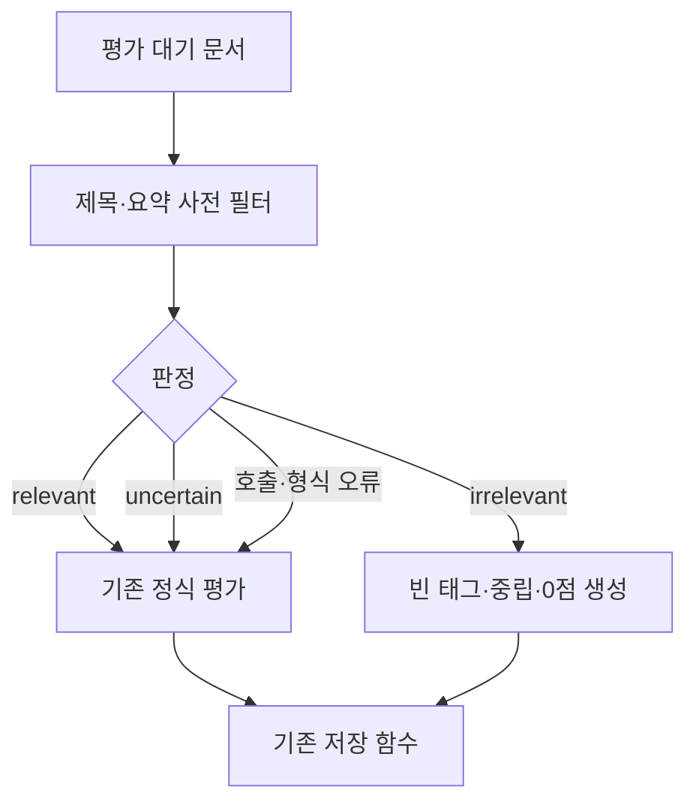

# 문서 관련성 사전 필터 개발 설계

상태: 구현 전 설계

작성일: 2026-08-17

대상: `document_assessment_hourly`

## 1. 목적

수집한 문서를 정식 LLM 평가에 보내기 전에 제목과 요약만으로 관련성을 짧게 판정한다.
명백히 무관한 문서는 정식 평가를 생략해 입력·출력 토큰을 줄인다.

중요한 문서를 놓치지 않는 것이 비용 절감보다 우선이다. 따라서 사전 필터가 관련성을
확신하지 못하거나 호출·응답 처리에 실패하면 기존 정식 평가로 넘긴다. 문서는 삭제하지 않는다.

## 2. 현재 동작

현재 흐름은 다음과 같다.

1. `document_assessment_hourly`가 평가가 필요할 문서를 최대 50건 조회한다.
2. `DocumentAssessor.build_messages()`가 출처, 발행시각, 제목, 요약, 본문과 전체 종목·지표
   후보를 하나의 프롬프트로 만든다.
3. Grok이 종목·지표 태그, 방향, 네 가지 점수와 근거를 한 번에 생성한다.
4. 결과를 `document`, `document_instrument`, `document_indicator`에 저장한다.

현재 RSS 수집기는 제목과 요약만 저장하며 `body`는 항상 `NULL`이다. 따라서 지금도 코드상
본문을 보내도록 되어 있지만 실제 모델 입력은 제목과 요약까지다. 향후 `full_text` 수집이
구현되면 `body`도 같은 프롬프트에 포함된다.

사전 필터의 당장 효과는 명백히 무관한 문서에 대해 후보 전체와 복잡한 평가 출력 생성을
피하는 것이다. 본문 수집이 시작되면 긴 본문 입력까지 피하므로 절감 폭이 더 커진다.

## 3. 결정

제목과 요약만 읽는 저비용 LLM 사전 필터를 추가한다. 결과는 세 가지다.

| 결과 | 의미 | 다음 동작 |
| --- | --- | --- |
| `relevant` | 직접 또는 간접 경로가 보인다 | 정식 평가 |
| `uncertain` | 정보가 부족하거나 경로가 가능하다 | 정식 평가 |
| `irrelevant` | 관심 대상에 닿는 합리적 경로가 명백히 없다 | 정식 평가 생략, 0점 저장 |

`irrelevant`일 때만 정식 평가를 생략한다. 이 규칙은 설정으로 완화하지 않고 코드와 테스트로
고정한다.

키워드 차단 목록은 만들지 않는다. 비용은 없지만 표현 변화에 약하고, 미국 금리·달러·중국
수요·반도체 공급망처럼 종목을 직접 언급하지 않는 중요한 문서를 잘못 버릴 가능성이 크다.
임베딩 필터도 이 단계에서는 도입하지 않는다. 현재 목적에는 별도 모델·인덱스·임계값 운영이
과하다.

## 4. 판단 범위

사전 필터는 기존 `LLM_PERSPECTIVE`와 동일한 관점을 사용한다. 기본 `global`에서는 한국이나
관심 종목을 직접 언급하지 않아도 다음과 같은 전달 경로가 있으면 `relevant` 또는
`uncertain`이어야 한다.

- 금리와 통화정책
- 환율과 달러 유동성
- 반도체 수요·가격·공급망
- 주요국 경기와 수출 수요
- 자본 흐름과 투자심리
- 관심 종목 또는 지표에 직접 영향을 주는 정책·실적·공시

반대로 지역 소비 분쟁, 프랜차이즈 계약, 연예, 사건·사고처럼 위 경로를 설명할 수 없는 문서는
`irrelevant`다.

예시 기사인 “PB 상품 판매 목표 미달하면 가맹 해지 압박…다비치안경 과징금”은 현재 관심
종목·지표와 직접 연결되지 않고 금리·환율·수요·공급망·투자심리 경로도 뚜렷하지 않으므로
`irrelevant`로 기대한다.

## 5. 사전 필터 입력과 출력

### 입력

사전 필터에는 다음 값만 전달한다.

- 현재 관점 설명
- 관심 종목의 티커와 이름
- 관심 지표의 표시 이름
- 문서 출처
- 문서 제목
- 문서 요약

`body`, 발행시각, 정식 평가 지시, 점수 기준, 출력 예시는 보내지 않는다. 지표의 provider와
series ID도 관련성 판단에 필요하지 않으므로 표시 이름만 보낸다.

### 출력

기존 `response_format()`과 Pydantic 검증을 재사용한다.

```json
{
  "decision": "relevant | irrelevant | uncertain",
  "reason": "한 문장 근거"
}
```

권장 타입은 다음 정도로 제한한다.

```python
class RelevanceDecision(BaseModel):
    decision: Literal["relevant", "irrelevant", "uncertain"]
    reason: str
```

별도 confidence 점수는 두지 않는다. 숫자 임계값을 새로 보정하는 대신 확신이 없으면
`uncertain`을 사용한다.

### 프롬프트 핵심 규칙

```text
제목과 요약만으로 관심 종목·지표에 닿는 경로가 명백히 없을 때만 irrelevant로 답한다.
직접 관련되면 relevant, 간접 경로가 가능하거나 정보가 부족하면 uncertain으로 답한다.
uncertain을 억지로 relevant나 irrelevant로 바꾸지 않는다.
```

## 6. 처리 흐름



사전 필터는 정식 평가 LangGraph 앞에서 한 번 호출한다. 별도의 재시도나 교정 호출은 하지
않는다. 구조화 응답을 파싱하지 못하거나 제공처 오류가 발생하면 즉시 정식 평가로 통과시킨다.
정식 평가의 기존 스키마 fallback과 1회 교정 동작은 그대로 유지한다.

`irrelevant` 결과는 다음 `Assessment`로 변환해 기존 저장 경로를 그대로 탄다.

```json
{
  "instruments": [],
  "indicators": [],
  "topics": [],
  "direction": "neutral",
  "scores": {
    "relevance": 0,
    "novelty": 0,
    "specificity": 0,
    "impact": 0
  },
  "new_facts": [],
  "reason": "[prefilter:v1] 명백히 무관하다고 판단한 한 문장 근거"
}
```

이렇게 저장해야 같은 문서가 매시간 다시 선택되지 않는다. 별도 상태 컬럼이나 테이블은
추가하지 않는다. `assessed_content_hash`가 현재 `content_hash`로 저장되므로 제목·요약·본문이
바뀌면 기존 규칙에 따라 다시 평가된다.

사전 필터로 끝난 결과의 `llm_model`에는 실제 사전 필터 모델명을 저장한다. 정식 평가로 넘어간
결과에는 기존 정식 평가 모델명을 저장한다. `AssessmentResult`가 문서별 모델명과 사전 필터
종료 여부를 함께 반환하게 하여 호출하지 않은 모델명을 기록하지 않도록 한다.

## 7. 모델 선택

`modules/llm.py`에 정식 평가 모델과 분리된 `document_prefilter_model()` 팩터리를 둔다. 키와
오류 분류는 기존 `ChatXAI`, `XAI_API_KEY`, `llm.invoke()`를 그대로 재사용한다.

사전 필터는 도구 호출이나 깊은 추론이 필요하지 않다. 구현 시점의 xAI 일반 텍스트 모델 중
구조화 출력을 지원하고 단가가 낮은 비추론 구성을 코드에서 명시한다. 2026-08-17 기준 후보는
`grok-4.3`의 reasoning `none`이다. 현재 프로젝트에 고정된 `langchain-xai` 버전이 이 옵션을
정확히 전달하는지는 구현 전에 통합 테스트 한 번으로 확인한다. 지원하지 않으면 모델명만
고정하고 짧은 입력·출력으로 비용을 제한한다.

xAI 모델명과 가격은 바뀔 수 있으므로 구현 시 공식 문서를 다시 확인한다.

- [xAI Grok 4.3 모델](https://docs.x.ai/developers/models/grok-4.3)
- [xAI 가격표](https://docs.x.ai/developers/pricing)
- [xAI 구조화 출력](https://docs.x.ai/developers/model-capabilities/text/structured-outputs)

## 8. 변경 예정 위치

코드 구현 시 다음 파일만 변경하는 것을 기본으로 한다.

| 파일 | 변경 내용 |
| --- | --- |
| `airflow/modules/assessment.py` | 사전 필터 타입·프롬프트·fail-open 분기·0점 결과 |
| `airflow/modules/llm.py` | 저비용 사전 필터 모델 팩터리 |
| `airflow/dags/document_assessment_hourly.py` | 두 모델 주입 및 문서별 실제 모델명 저장 |
| `tests/modules/test_assessment.py` | 분기·입력 제한·오류 처리·저장 계약 테스트 |
| `docs/document-assessment-workflow.md` | 실제 구현 후 흐름도 갱신 |

DB 마이그레이션, 새 테이블, 새 외부 의존성은 필요하지 않다.

사전 필터 프롬프트를 도입하면 `PROMPT_VERSION`을 올린다. 이 경우 기존 평가 문서도 한 번
재선택된다. 재평가량은 기존 `batch_size`로 제한하며, 배포 직후에는 작은 배치로 비용을 확인한
뒤 기본 50건으로 되돌린다.

## 9. 실패 처리

| 상황 | 처리 |
| --- | --- |
| 사전 필터가 `relevant` 반환 | 정식 평가 |
| 사전 필터가 `uncertain` 반환 | 정식 평가 |
| 사전 필터 JSON이 잘못됨 | 로그 후 정식 평가 |
| 사전 필터 API 오류·timeout·429 | 로그 후 정식 평가 |
| 사전 필터가 `irrelevant` 반환 | 정식 평가 생략, 0점 저장 |
| 정식 평가 실패 | 현재와 동일하게 미평가 상태로 두고 재시도 |
| DB 저장 실패 | 현재와 동일하게 해당 문서 트랜잭션 rollback |

사전 필터 장애 때문에 문서가 누락되거나 Airflow 태스크 전체가 실패해서는 안 된다. 다만
fail-open 뒤의 정식 평가까지 실패하면 기존 오류 정책을 그대로 따른다.

## 10. 검증

### 단위 테스트

최소한 다음 사례를 스크립트 모델로 고정한다.

1. 사전 필터 프롬프트에 제목과 요약은 있지만 `body`는 없다.
2. `irrelevant`이면 사전 필터 모델만 한 번 호출하고 정식 모델은 호출하지 않는다.
3. `relevant`이면 정식 모델을 호출한다.
4. `uncertain`이면 정식 모델을 호출한다.
5. 사전 필터 응답이 깨지거나 호출이 실패해도 정식 모델을 호출한다.
6. 사전 필터로 끝난 결과는 빈 태그, `neutral`, 네 항목 모두 0점이다.
7. 사전 필터 결과에는 실제 사전 필터 모델명이 저장된다.
8. 정식 평가 결과에는 실제 정식 모델명이 저장된다.

### 회귀 문서 세트

다음 문서를 fixture로 둔다.

| 기대 결과 | 예시 |
| --- | --- |
| `irrelevant` | 다비치안경 PB 상품·가맹 해지 압박·과징금 |
| `relevant` | 삼성전자 또는 SK하이닉스 실적·공급망 기사 |
| `relevant` | 원/달러 환율 급등 기사 |
| `relevant` 또는 `uncertain` | 연준 금리 결정, 미국 물가·고용 기사 |
| `uncertain` | 제목만으로 반도체 수요 경로를 확정하기 어려운 중국 산업 기사 |

실제 LLM 응답 자체를 단위 테스트의 고정 정답으로 삼지는 않는다. 배포 전 위 문서들을 수동
실행해, 관련 문서가 `irrelevant`로 떨어지는 거짓 음성이 0건인지 확인한다.

## 11. 비용 확인

문서 한 건당 기존 정식 평가 비용을 `F`, 사전 필터 비용을 `P`, 정식 평가 통과 비율을 `q`라
하면 변경 후 평균 비용은 다음과 같다.

```text
기존: F
변경: P + qF
절감 조건: (1 - q)F > P
```

즉, 사전 필터가 정식 평가 비용 대비 충분히 작고 무관 문서 비율이 `P / F`보다 높아야 실제로
절감된다. 배포 후 첫 1주 동안 다음 값만 집계한다.

- 전체 문서 수
- `irrelevant`, `relevant`, `uncertain`, fail-open 건수
- 사전 필터와 정식 평가의 입력·출력 토큰
- 사전 필터 추가 전후 문서당 평균 비용

이미 사용 중인 LangSmith 추적과 모델 응답의 token usage를 우선 사용한다. 이 측정을 위해 새
테이블은 만들지 않는다. 절감 조건을 만족하지 못하면 사전 필터를 유지하지 않고 제거한다.

## 12. 완료 조건

- 사전 필터 요청에 `body`가 절대 포함되지 않는다.
- `irrelevant`만 정식 평가를 건너뛴다.
- `uncertain`과 모든 사전 필터 오류는 정식 평가로 통과한다.
- 예시 다비치안경 기사는 정식 평가 모델을 호출하지 않는다.
- 연준·환율·반도체처럼 간접 경로가 있는 회귀 문서는 차단되지 않는다.
- 차단한 문서도 삭제되지 않고 0점 평가로 남는다.
- 같은 내용의 문서를 다음 시간에 다시 사전 필터링하지 않는다.
- 새 DB 테이블과 새 외부 패키지를 추가하지 않는다.
- 실제 토큰 사용량으로 비용 절감 여부를 확인할 수 있다.
